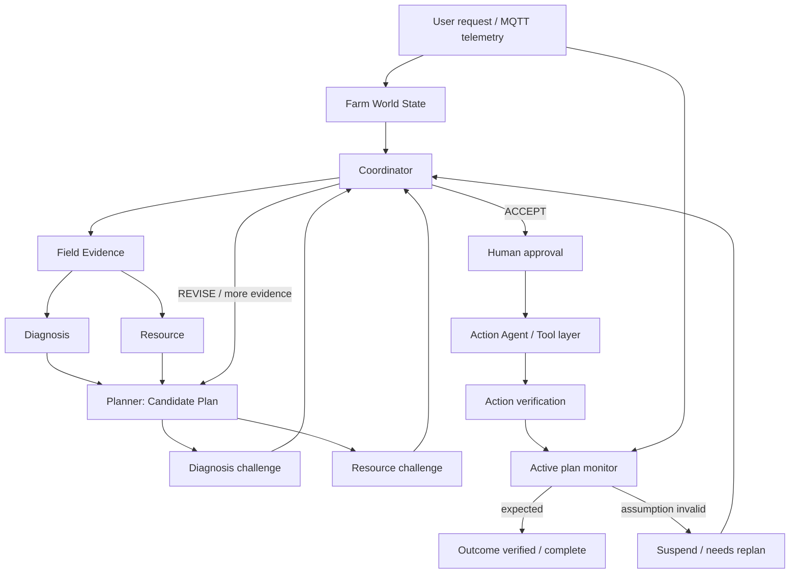

# FarmOps AI — Kế hoạch Hackathon v4 (Track B: Smart Agriculture)

> **Trạng thái:** planning/design only. Tài liệu này thay thế plan v3 làm nguồn định hướng implementation.
> **Product thesis:** **FarmOps AI là một Multi-Agent Farm Operations System có khả năng tạo, phản biện, thực thi, kiểm chứng và tự điều chỉnh operational plan dựa trên live MQTT evidence.**

---

## 1. Outcome, constraints và nguyên tắc chọn scope

### Outcome

FarmOps AI điều phối vận hành tưới cho Khu A theo vòng khép kín:

`SENSE → REASON → CHALLENGE → PLAN → APPROVE → ACT → VERIFY → OBSERVE → REPLAN`

Sản phẩm không kết thúc ở khuyến nghị hoặc ở việc API trả `200`. Một plan đang chạy tiếp tục bị giám sát bởi telemetry mới; nếu evidence làm một assumption mất hiệu lực, hệ thống phải suspend plan và tạo plan version tiếp theo hoặc inspection task phù hợp.

### Constraints

- Dữ liệu đầu vào là MQTT/live simulator; không tự bịa reading khi sensor stale, offline hoặc thiếu.
- Không điều khiển phần cứng thật. Action được giới hạn ở simulated schedule, inspection task, notification trong web app, hoặc record API có read-back.
- Chỉ Planning và Reporting cần LLM. Time, freshness, trust, water-balance, permission, lifecycle và verification là deterministic.
- Giữ orchestrator async hiện có theo hướng framework-neutral. Không thêm LangGraph, ADK, CrewAI, AutoGen hoặc RAG chỉ để tăng số công nghệ.
- Ưu tiên một vertical slice closed-loop chạy được, hơn dashboard/widget hoặc integration phụ.

### Quyết định phạm vi

| Giữ và làm sâu | Không thuộc Hackathon scope | Chỉ làm nếu P0/P1 đã ổn |
|---|---|---|
| MQTT, normalized telemetry, `event_time`, `received_at`, freshness, trust/DCS, water-balance, multi-agent challenge/revision, plan lifecycle, approval, verification, re-planning | Telegram bot/API/webhook, SHAP, Time Machine, interactive what-if, full ETo/time-to-wilt, RAG không có corpus, Kafka/Redpanda work riêng, external platform complexity | IsolationForest, Water Saved, enhanced moisture-urgency prediction |

Kafka/Redpanda chỉ được **reuse không sửa** nếu sample project đã chạy. Nếu setup/debug đáng kể, critical path dùng queue đơn giản; không pitch event platform là product feature.

---

## 2. Narrative và tiêu chí thành công

**Không phải:** `MQTT → LLM → recommendation → END`.

**Là:** FarmOps AI giữ một Farm World State có nguồn gốc telemetry. Nhiều agent tạo proposal, phản biện proposal, yêu cầu evidence bổ sung và revision. Mỗi action được xác minh ở hai lớp; evidence runtime tiếp tục đánh giá plan assumption để tự sửa khi thực tế lệch kỳ vọng.

### Giá trị có thể demo

1. Một yêu cầu tưới tạo **Plan V1** có evidence, assumptions, expected outcomes và quyền action rõ ràng.
2. Diagnosis và Resource có thể độc lập phản biện hoặc chấp nhận proposal; Coordinator route revision thay vì coi workflow là hand-off cố định.
3. Pump-flow drop hoặc sensor stale làm **active plan mất hiệu lực**, không phải chỉ đổi màu dashboard.
4. Hệ thống tạo inspection task khi bằng chứng không đủ, read-back task, rồi dùng evidence mới để resume/re-plan.
5. Operator nhìn được câu trả lời cho: *AI đã dùng evidence nào, ai phản đối gì, và vì sao plan thay đổi?*

---

## 3. Core data foundation và Farm World State

### Device baseline

P0 hỗ trợ tối thiểu 4/6 device; demo ưu tiên 5 device để có cross-sensor reasoning:

| Device | Vai trò trong decision |
|---|---|
| `SOIL_01` | soil moisture, soil temperature; căn cứ nhu cầu tưới và response sau tưới |
| `WEATHER_01` | temperature, humidity; ngữ cảnh urgency |
| `PUMP_01` | flow rate, power; action/outcome evidence |
| `TANK_01` | water reserve; resource constraint và water-balance |
| `SUN_01` | lux; urgency context |
| `PH_01` | support water-quality scope; không bắt buộc trong mọi workflow |

Mỗi normalized reading có `readingId` do server sinh, `device`, `metric`, `value`, `unit`, `event_time`, `received_at`, age, freshness và state `FRESH | STALE | OFFLINE` (hoặc `MISSING` cho metric chưa từng nhận). `event_time` quyết định window/order; `received_at` dùng để đánh giá freshness và audit ingestion delay.

### Farm World State là source of truth

Agent trao đổi bằng structured state và typed decision records; natural-language output chỉ là explanation, không phải nguồn dữ liệu vận hành.

```json
{
  "farmStateVersion": 42,
  "updatedAt": "2026-08-16T10:05:04Z",
  "telemetry": { "latest": [], "windows": [], "connectivity": {} },
  "trust": { "byDevice": {}, "byScope": {} },
  "crossSensor": { "waterBalance": [], "anomalies": [] },
  "resources": { "tankReserve": {}, "pumpAvailability": {} },
  "activePlan": { "planId": "PLAN-001", "version": 1 },
  "plans": [],
  "actions": [],
  "verifications": [],
  "inspectionTasks": [],
  "agentDecisions": [],
  "trace": []
}
```

World State version và immutable trace record giúp Coordinator biết state nào đã được dùng cho mỗi decision. LLM chỉ nhận slice state đã được policy lọc; LLM không được invent state hoặc source evidence mới.

### Trust, freshness và partial mode

Giữ DCS/Sensor Trust theo scope để không biến một sensor lỗi thành lỗi toàn hệ thống.

- `F` freshness: đóng góp theo age/TTL và trọng số metric.
- `C` completeness: coverage của metric cần cho scope.
- `K` consistency/knowledge: physical rules, stuck-at, range, spike và cross-sensor inconsistency.
- DCS/tier áp vào behavior thực tế, không chỉ badge: `AUTO`, `PROPOSE`, `INVESTIGATE`.

Evaluator DCS versioned dùng cùng một công thức cho mọi agent/tool:

```text
DCS = 0.45 × F + 0.35 × C + 0.20 × K
F   = weighted mean(freshness theo TTL) của metric trong scope
C   = weighted coverage của reading khác MISSING/OFFLINE trong scope
K   = max(0, 1 − tổng penalty của deterministic consistency rules đã fired)
```

Metric required `MISSING/OFFLINE` hoặc freshness = 0 cap DCS ở 0.40; `K < 0.50` cap DCS ở 0.55. Snapshot ghi `dcsPolicyVersion`, F/C/K, caps và fired rules để cùng telemetry luôn cho cùng verdict và trace có thể replay đúng.

`registry` là source of truth cấu hình TTL, required metrics và trọng số theo scope; không hard-code TTL rải trong agent. Default policy được chốt để các team không diễn giải khác nhau: `AUTO` khi DCS ≥ 0.85, `PROPOSE` khi 0.50–0.84, `INVESTIGATE` khi < 0.50; metric required bị `STALE/OFFLINE` không được chứng minh cho action tương ứng dù DCS tổng vẫn cao. Message được dedupe theo `(device, metric, event_time)`, xử lý theo watermark `event_time`, và late/out-of-order evidence được gắn cờ/audit thay vì bị bỏ im lặng.

`SOIL_01 = STALE` không cho phép bịa giá trị mới. Hệ thống có thể dùng `WEATHER_01`, `TANK_01`, `PUMP_01` còn fresh để đánh giá phần khả thi, nhưng block quantity quyết định dựa vào soil, ghi uncertainty và tạo inspection task nếu policy yêu cầu.

### Water-balance / physical reasoning

Không dựa vào dung tích tank chưa biết. Khi bơm chạy, kiểm tra hướng và consistency giữa pump flow, tank-level slope, soil-moisture response và expected/actual trend:

```text
flow > 0 + tank giảm + soil không tăng    → suspected delivery failure/leak/blockage
flow > 0 + tank không đổi                 → suspicious flow/tank evidence
power cao + flow ≈ 0                       → pump/valve anomaly
pump off + soil tăng                       → external water/valve leak/context needed
```

Các kết quả trên là deterministic Evidence/Diagnosis input. IsolationForest, nếu có, chỉ bổ sung anomaly evidence; core safety và anomaly path vẫn chạy bằng domain rules.

---

## 4. Plan là first-class object

Plan không được là paragraph hoặc một tool call đơn lẻ. Mọi plan immutable theo version; revision tạo object/version mới, giữ relation tới version trước và evidence thay đổi.

```json
{
  "planLineageId": "PLAN-001",
  "planRevisionId": "PLAN-001-V2",
  "version": 2,
  "revisionOfPlanRevisionId": "PLAN-001-V1",
  "status": "PROPOSED",
  "goal": { "type": "IRRIGATION", "area": "A" },
  "createdFromStateVersion": 42,
  "evidenceRefs": ["r_soil_120", "r_tank_081", "r_weather_044"],
  "constraints": ["tankReserve >= 20%", "no pump overlap"],
  "assumptions": [],
  "actions": [],
  "expectedOutcomes": [],
  "confidence": { "dcs": 0.73, "tier": "PROPOSE" },
  "requiresApproval": true,
  "challenges": [],
  "decisionLog": []
}
```

`planRevisionId` là identity bất biến của một version; `planLineageId` nhóm các revision cùng mục tiêu. Vì vậy Plan V1 không bị mutate: một challenge chuyển V1 thành lịch sử `CHALLENGED`, còn Planner tạo object V2 mới bắt đầu ở `DRAFT` hoặc `PROPOSED` và liên kết về V1.

### Assumption là capability cờ đầu

Mỗi plan có assumption ID, expression/policy deterministic khi có thể, evidence links, affected action và trạng thái. Ví dụ:

| Assumption | Evidence hỗ trợ | Kiểm tra runtime | Khi invalid |
|---|---|---|---|
| `A1: PUMP_FLOW_MIN` | `PUMP_01.flow_rate` trước action | flow ≥ minimum trong observed window | suspend remaining irrigation, inspect pump/valve |
| `A2: TANK_SAFE_RESERVE` | `TANK_01.level` | tank ≥ safe reserve | block/downgrade water allocation |
| `A3: SOIL_EVIDENCE_FRESH` | `SOIL_01` freshness | `FRESH` theo TTL | quantity decision blocked; inspection task |
| `A4: TRUST_SUFFICIENT` | scope DCS + consistency evidence | DCS/tier vẫn hợp action | downgrade autonomy/escalate |
| `A5: RESOURCE_AVAILABLE` | pump/schedule/resource state | no conflict remains | reschedule/revise |

Lineage phải truy được: `MQTT Reading → Evidence → Assumption → Plan → Action`. New telemetry làm assumption chuyển `VALID → INVALIDATED`, mang theo reason/evidence reference; không overwrite history.

Các contract tối thiểu phải được dùng chung trong World State:

| Record | Fields bắt buộc |
|---|---|
| `Assumption` | `assumptionId`, predicate/policy, `status`, evidence refs, observation window, affected action IDs, invalidatedAt/reason/evidence |
| `Challenge` | `challengeId`, target `planRevisionId`, agent, `blocking`, status, reason, evidence refs, requested evidence/revision |
| `Approval` | `approvalId`, exact `planRevisionId` + hash, approver, decision, timestamp, expiry, comment |
| `ExpectedOutcome` | metric/predicate, threshold/tolerance, observation window, evidence source, affected assumption |
| `Verification` | action/outcome type, expected, observed, pass/fail, time window and evidence refs |
| `ToolPermission` | tool name, allowed plan statuses, minimum tier, approval requirement, idempotency key |

### Plan lifecycle

```text
Vn: DRAFT → PROPOSED → APPROVED → EXECUTING → VERIFIED → COMPLETED
                   │              │
                   │              └→ REJECTED
                   └→ CHALLENGED ──creates──> V(n+1): DRAFT → PROPOSED

Exception: SUSPENDED | NEEDS_REPLAN | FAILED | ESCALATED
```

- `PROPOSED → APPROVED` chỉ hợp lệ khi không còn blocking challenge mở. `CHALLENGED` không đồng nghĩa failed: blocking challenge đóng revision hiện tại vào lịch sử và Coordinator yêu cầu evidence/revision mới; concern không-blocking vẫn nằm trong decision log cho approver.
- `APPROVED/EXECUTING` vẫn chịu active monitoring.
- `SUSPENDED` bảo toàn audit/history, ngăn action còn lại gây side effect.
- `NEEDS_REPLAN` tạo Plan V(n+1), không mutate Plan Vn.

---

## 5. Multi-Agent architecture và interaction protocol

### Agent boundaries

| Agent | Objective / input | Structured output | Permission |
|---|---|---|---|
| **Coordinator** | User goal, World State, plan lifecycle, agent responses | route decision, consensus/revision request, lifecycle event | route only; không invent threshold/evidence, không side effect |
| **Field Evidence** | MQTT/normalized telemetry and connectivity | evidence bundle, freshness/connectivity facts | read-only state access |
| **Diagnosis** | evidence bundle, trust, water-balance/anomaly signals | diagnosis proposal, risk, objections, required evidence | không plan action hoặc call tool |
| **Resource** | tank/pump/schedule availability, plan actions | allocation proposal or resource objection | không create irrigation action |
| **Planner** | accepted facts, diagnosis/resource input, SOP/policy | candidate/revised `Plan` with assumptions/outcomes | no direct side effect |
| **Action** | approved plan, tier, permission policy | action/tool result or inspection task | sole caller of approved tools |
| **Reporting** | trace, plan history, verification | operator report and technical explanation | read-only; no decision/action |

Không agent nào chỉ là deterministic helper bị đổi tên. Field Evidence owns telemetry boundary; Diagnosis owns anomaly meaning; Resource owns feasibility; Planner owns plan synthesis; Action owns side effect; Coordinator owns routing/lifecycle.

Một component được gọi là Agent ở đây khi nó có objective, input/output contract, permission boundary và trace decision riêng; nó không cần phải gọi LLM. Field Evidence là agent vì nó sở hữu boundary dữ liệu và phát facts có provenance, không phải vì nó diễn giải dữ liệu.

### Shared interaction vocabulary

Tất cả proposals/challenges là records trong World State:

```text
PROPOSE | ACCEPT | REJECT | REQUEST_MORE_EVIDENCE | REVISE | ESCALATE_TO_HUMAN
```

Một challenge chứa `targetPlanRevisionId`, `agent`, `status`, `reason`, `evidenceRefs`, `affectedAssumptionIds` và recommended next route. `REVISE` là interaction event tạo revision mới, không phải mutation của revision đang bị challenge. Coordinator chỉ route theo facts/protocol; không tự thay thế reasoning chuyên môn.

### Operational graph



### Normal proposal/challenge/revision path

1. Coordinator creates a request context and requires Field Evidence bundle. Đây là **default route**, không phải graph bắt buộc: runtime invalidation có thể route thẳng đến Diagnosis, Resource hoặc Action/inspection theo affected assumption.
2. Diagnosis and Resource run independently from the same state snapshot. They may request more evidence before a candidate plan exists.
3. Planner produces Plan V1 with explicit assumptions and expected outcomes.
4. Diagnosis can challenge health/physical validity; Resource can reject unfeasible water/schedule allocation. Neither response is a silent boolean.
5. Coordinator accepts only when all blocking challenges are resolved; otherwise marks V1 `CHALLENGED`, routes `REVISE` to Planner or requests new evidence.
6. Planner creates V2; trace links V2 to V1 and the challenge evidence.
7. Human approval is required whenever tier/policy says so. Only then may Action call the allowed tool.

This allows real disagreement without requiring a separate Critic agent. Diagnosis + Resource + Trust/Safety form the challenge layer.

---

## 6. Permission, approval và inspection workflow

### Trust-tier behavior

| Tier | Operational behavior |
|---|---|
| `AUTO` | permitted low-risk scheduled action after policy checks; approval remains optional when action policy marks it critical |
| `PROPOSE` | Planner may propose; a valid human approval for the exact revision is required before its simulated operational action |
| `INVESTIGATE` | irrigation action blocked; only inspection task, safe notification and report are permitted |

Tool layer enforces `plan.status`, `approval`, tier, evidence requirements and idempotency **before** calling any side-effect API. Planner, Resource and Diagnosis never call side-effect APIs directly.

Minimum allowlist: một schedule cần `APPROVED`; `AUTO` được thực thi sau policy checks (và approval nếu action policy yêu cầu), còn `PROPOSE` cần approval chưa hết hạn cho đúng revision hash. Proposal draft cần `PROPOSE` hoặc cao hơn nhưng không có side effect; inspection task được phép từ `INVESTIGATE` khi có reason/evidence. Idempotency key được tạo từ `planRevisionId + tool + canonical parameters`, nên retry hoặc telemetry trùng không tạo schedule/task trùng.

### Inspection task is a core safe action

```text
stale / missing / conflicting evidence
→ agent cannot safely conclude
→ Coordinator records uncertainty
→ Action Agent creates inspection task via API
→ read-back verifies task ID, status and parameters
→ task/result enters World State
→ Coordinator chỉ resume workflow đang chờ trước action nếu assumptions còn valid;
  active plan đã invalidated luôn đi qua revision/re-plan mới
```

Inspection tasks must carry affected device(s), reason, evidence, priority and expected manual check. Web notification center exposes high/critical banner, task badge and `unread → acknowledged → resolved` state; no Telegram dependency.

---

## 7. Verification, monitoring và closed-loop correction

### Hai lớp verification

| Layer | Question | Evidence |
|---|---|---|
| **Action Verification** | API/tool có tạo đúng entity không? | `POST` result + `GET` read-back, id/status/parameters match |
| **Outcome Verification** | Thực tế sau action có gần expected outcome không? | MQTT window + Ghost Farm expected-vs-actual + water-balance |

Action Verification PASS không được suy diễn Outcome Verification PASS. Ví dụ schedule `IRR-104` tồn tại đúng parameters, nhưng actual `PUMP_01.flow_rate = 6 L/min` thay vì expected ≥15 L/min; outcome fails và plan vẫn phải bị re-evaluate.

Expected outcomes là policy-backed, không phải prose "gần expected". Ở demo, irrigation có thể yêu cầu flow ≥15 L/min trong cửa sổ 60 giây và soil-moisture trend tăng trong cửa sổ post-action đã cấu hình. Threshold, tolerance và time window nằm trên `ExpectedOutcome`; evidence required stale/missing trả `INCONCLUSIVE` và route partial mode/inspection, không bao giờ PASS.

### Active plan monitoring

Không gọi LLM cho từng MQTT message. Normalizer updates World State; deterministic assumption evaluators subscribe to active plan:

```text
new MQTT reading
→ update World State
→ does it affect an active assumption?
   ├─ no: retain plan
   └─ yes: evaluate deterministic policy / divergence
            ├─ valid: continue
            └─ invalid: append evidence, invalidate assumption,
                        suspend plan, notify Coordinator, NEEDS_REPLAN
```

Coordinator then selects only necessary agents: Diagnosis for anomaly cause, Resource for revised feasibility, Planner for V(n+1), or Action for an inspection task. This is a loop over state, not a rerun of the whole pipeline by default.

Monitor ghi idempotent invalidation key `(planRevisionId, assumptionId, triggeringEvidenceVersion)`, debounce reading lặp trong observation window và cho phép tối đa một re-plan đang mở cho mỗi assumption. Nhờ đó stream MQTT không sinh duplicate suspension, ticket hay Plan V2.

### Ghost Farm is outcome evidence, not a widget

Keep a narrow expected-vs-actual model for important metrics only:

```text
expected pump flow / soil response
vs actual pump flow / soil response
→ divergence evidence
→ Outcome Verification failure
→ affected assumption invalidated
→ plan suspended and re-planned
```

Do not build a full digital-twin platform or interactive simulator. The dashboard must expose the assumption and plan affected by divergence.

P0 Outcome Verification dùng predicate expected-vs-actual MQTT trực tiếp kể cả khi Ghost Farm chưa sẵn sàng. Ghost Farm là P1 visualization/model enrichment của cùng evidence; nó không được là cơ chế duy nhất chứng minh outcome verification.

### Fault injection must drive the real loop

Fault controls belong at normalize/simulator boundary and emit normal telemetry, never a UI-only mock.

| Fault | Expected architecture reaction |
|---|---|
| `PUMP_01` flow drops 18 → 5 | invalidate flow/outcome assumption → Diagnosis objection → suspend V1 → Planner V2 + inspection task |
| `SOIL_01` stops publishing | freshness becomes STALE/OFFLINE → DCS falls → partial mode, soil-dependent quantity limited → inspection task |
| contradictory tank/flow/soil movement | water-balance evidence → Diagnosis challenge or re-plan |

---

## 8. Explainability, trace và responsive operator UX

### Evidence Graph and Decision Replay

Preserve a queryable lineage, not prose only:

```text
Reading → Evidence → Agent decision → Plan V1 → Assumption A1
        → New Reading → INVALIDATES → Diagnosis objection
        → Plan V2 → Action → Action Verification → Outcome Verification
```

Each edge/trace event stores correlation IDs, state/plan version, agent, timestamp and reason. Replay explains plan evolution (`V1 → V2`), not a full historical time-machine UI.

### UX P0

- mobile/tablet responsive screens for Farm State, Plan Detail, Approval, Inspection Tasks and Trace/Replay;
- device freshness/connectivity and DCS/tier displayed with reason, not color alone;
- plan card shows version, status, assumptions, evidence chips, objections and expected outcomes;
- action verification and outcome verification are visually distinct;
- notification center supports HIGH/CRITICAL state and acknowledgement;
- Agent Constellation is P1 visualization of real trace events: `Planner → PROPOSE`, `Resource → OBJECT`, `Planner → REVISE`, `Coordinator → ACCEPT`, `MQTT → INVALIDATE`.

---

## 9. Scope priority and implementation sequence

### P0 — must have

- MQTT ingestion, normalized telemetry, `event_time`, `received_at`, freshness/connectivity and ≥4 devices;
- Farm World State and per-scope DCS/Sensor Trust;
- deterministic cross-sensor water-balance;
- at least 3 meaningful agents, with proposal/challenge/revision interaction;
- structured Plan, versioning, evidence, assumptions, expected outcomes and lifecycle;
- human approval, tool permission layer, inspection task and read-back verification;
- stale/offline/partial mode without fabricated readings;
- Evidence Graph/agent trace;
- Active Plan Monitoring, assumption invalidation, outcome verification and re-planning;
- replay fixture hoặc scripted telemetry fault chứng minh end-to-end invalidation/re-plan path;
- responsive web UI.

### P1 — wow only after P0 vertical slice

- interactive Fault Injection controls with actual system response;
- Ghost Farm expected-vs-actual divergence;
- Agent Constellation fed by trace events;
- visual/animated Decision Replay and plan-history experience;
- autonomy/tier visualization;
- Water Balance visualization.

### P2 — optional

- IsolationForest, only if feature/data story is defensible and it does not replace rule-based core;
- Water Saved, only with documented baseline;
- lightweight moisture-depletion/irrigation-urgency trend, clearly non-precise.

P0 UX chứa trace queryable tối thiểu (evidence, challenges, versions, actions, verification). P1 mới thêm trải nghiệm replay/constellation animation; hai mức này không phải hai định nghĩa mâu thuẫn của trace.

### Explicitly removed

Telegram integration; SHAP; Time Machine; interactive What-if slider; full ETo or exact time-to-wilt claims; RAG without a real corpus; any Kafka/Redpanda refactor/setup beyond free reuse; new agent framework; platform/dependency work not needed by P0.

### Vertical delivery order

1. Telemetry → normalized reading → freshness/DCS → World State.
2. One irrigation request → evidence bundle → diagnosis/resource responses → Plan V1 → challenge/revision → approval.
3. Tool action → read-back → outcome monitor.
4. Fault evidence → invalidated assumption → Plan V2 or inspection task.
5. Only then polish Ghost Farm, trace animation and P2 features.

---

## 10. Flagship demo narrative

### Demo 1 — Normal planning

```text
Manager requests irrigation for Area A
→ fresh MQTT evidence collected
→ Diagnosis and Resource provide inputs
→ Planner proposes Plan V1 with A1..A5
→ challenge resolved or Plan V2 is generated
→ Coordinator accepts
→ manager approves
→ Action creates schedule
→ Action Verification passes by GET read-back
→ plan stays active for outcome monitoring
```

### Demo 2 — Runtime failure / self-correction

```text
Plan V1 executing with expected PUMP_01 flow = 18 L/min
→ fault injection changes observed flow to 5 L/min
→ World State + water-balance/ghost-farm divergence update
→ A1 invalidated; Outcome Verification fails
→ Coordinator suspends remaining unsafe action
→ Diagnosis records objection
→ Resource rechecks feasibility
→ Planner produces V2
→ Action creates and verifies pump/valve inspection task
```

### Demo 3 — Stale sensor / partial mode

```text
SOIL_01 stops publishing
→ freshness becomes STALE
→ DCS/trust changes; system does not fabricate soil value
→ available weather/tank/pump evidence remains usable
→ soil-dependent irrigation quantity is blocked or limited
→ manual verification/inspection task is created and read back
→ new field evidence lets Coordinator resume or re-plan
```

Demo narration must say *why Plan V2 exists*: it was caused by a named assumption, evidence and agent challenge, not a generic "AI recalculated" statement.

---

## 11. Track B acceptance coverage

| Track B requirement | Coverage in this plan | Demo evidence |
|---|---|---|
| At least 4/6 devices | Section 3 device baseline, World State | device/freshness panel with SOIL, WEATHER, PUMP, TANK (+SUN) |
| At least 3 Agents; a task coordinates ≥2 | Sections 5–6 | Diagnosis + Resource challenge Planner; Coordinator routes revision |
| MQTT affects decision | Sections 3, 4, 7 | evidence references and assumption evaluator change plan status |
| Tool/API creates action | Section 6 | Action Agent creates schedule or inspection task |
| Verification after action | Section 7 | POST/GET read-back, parameters/status match |
| Responsive mobile UI | Section 8 | plan approval/task/trace screens at phone width |
| Stale data/manual verification | Sections 3 and 6 | SOIL stale → partial mode → inspection task |
| Inspection task | Section 6 | trigger → API create → read-back → World State → resume loop |
| Clear use of data | Sections 4 and 8 | Evidence Graph / Decision Replay |

---

## 12. Risks and guardrails

| Risk | Guardrail |
|---|---|
| Scope returns to linear LLM pipeline | require challenge records and active-plan invalidation in every end-to-end test |
| Too many agents with no distinction | keep role/permission/output table as contract; do not add agents for animation |
| Telemetry weak/stale at demo | fixtures/replay and partial-mode path; never fabricate readings |
| LLM unavailable or ungrounded | validate structured output/evidence; deterministic fallback yields safe proposal or inspection task |
| Outcome monitoring overcalls LLM | deterministic assumption evaluator filters MQTT events before routing agents |
| Ghost Farm becomes a cosmetic chart | divergence must point to assumption ID and invoke outcome/replan flow |
| Sample infrastructure consumes time | timebox and bypass it; it is not scored product scope |
| Safety bypass by prompt | tool layer validates plan status, tier, approval, parameters and idempotency |

---

## 13. Final design validation

1. **Is this only a linear pipeline without agent names?** **No.** Candidate plans can be challenged, revised and re-approved; active telemetry routes back into Coordinator.
2. **Can an agent challenge/reject/request revision from another?** **Yes.** Diagnosis/Resource emit structured `REJECT`, `REQUEST_MORE_EVIDENCE` or `REVISE` records against a plan version.
3. **Can new MQTT invalidate an approved/executing plan?** **Yes.** deterministic assumption monitoring sets `INVALIDATED`, then `SUSPENDED/NEEDS_REPLAN`.
4. **Does actual versus expected return to planning?** **Yes.** Action and Outcome Verification are separate; outcome divergence triggers Plan V(n+1) or inspection.
5. **Can the full chain be traced?** **Yes.** `sensor evidence → agent decision/challenge → plan/assumption → action → actual outcome → re-plan` is the Evidence Graph and Decision Replay contract.

The plan is considered implementation-ready only if each P0 vertical slice demonstrates these five answers in runtime trace, not merely in a diagram.
