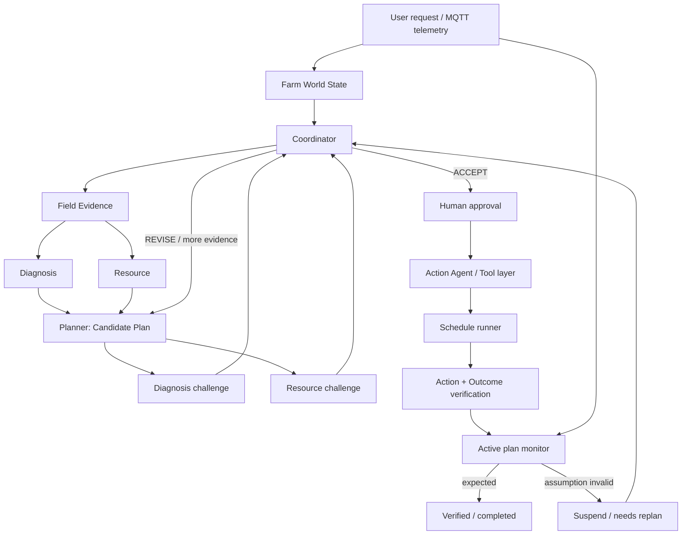

# FarmOps AI — Kế hoạch v5.2 (final) — Track B: Smart Agriculture

> **Trạng thái:** design/implementation-ready. Thay thế v4. v5.1 cập nhật theo payload FARM thật (`plans/input_format.txt`); v5.2 chuyển lưu trữ sang Supabase Postgres, mỗi sensor một bảng.
> **Khung tư duy:** đây là **hệ thống vận hành thật** chạy trên plant model mô phỏng, không phải kịch bản demo. Mọi quyết định thiết kế được đánh giá bằng câu hỏi *"chạy liên tục nhiều ngày không người trực thì hỏng ở đâu"*, không phải *"5 phút trên máy chiếu có đẹp không"*.
> **Product thesis:** FarmOps AI tạo, phản biện, thực thi, kiểm chứng và tự điều chỉnh operational plan dựa trên live MQTT evidence.
> **Track B acceptance là tập con** của tiêu chí nghiệm thu (mục 12), không phải mục tiêu thiết kế.

---

## 0. Thay đổi so với v4 (danh sách check)

| # | Vấn đề trong v4 | Xử lý ở v5 |
|---|---|---|
| V1 | Giả định payload có `event_time` mỗi device, mỗi device một message | **Mục 3 viết lại theo `plans/input_format.txt` thật**: một message = một batch chứa mảng device, chỉ có `timestamp`/`epoch` chung |
| V2 | Bỏ qua `status`, `environment`, `teamCode` trong payload | Mục 3.3: `status` thành tín hiệu health hạng nhất; lọc bắt buộc theo `teamCode`/`environment` |
| V3 | TTL hard-code theo giây, nhưng cadence batch chưa biết | Mục 3.5: TTL = `ttl_batches × observed_batch_period` (EWMA), tự thích ứng |
| V4 | Rule K không có bảng penalty; hỏng cứng trộn chung với suy giảm mềm | Mục 4.3: tách **hard-fail → status `SUSPECT`** khỏi **soft penalty → K**, hết double-count, hết case "sensor kẹt mà vẫn AUTO" |
| V5 | Tier không có trễ → dao động quanh ngưỡng gây giật cục | Mục 4.5: hysteresis + dwell, hạ tier tức thì / nâng tier phải chờ |
| V6 | Không có ví dụ số → mỗi người tự hiểu một kiểu | Mục 4.4: 4 ví dụ tính tay, dùng thẳng làm fixture test |
| V7 | Plan sinh ra `schedule` nhưng **không component nào chạy schedule** | Mục 9: schedule runner + biên actuation `ACTUATION_TARGET` |
| V8 | Outcome Verification giả định bơm sẽ chạy — không đúng khi chỉ đọc stream ngoài | Mục 9.3: chế độ `observational` trả `INCONCLUSIVE`, không bao giờ PASS/FAIL giả |
| V9 | "Ngân sách nước" không có sổ cái, không đối chiếu được | Mục 8: water ledger theo `% tank drawdown` + phút bơm (không quy ra lít khi chưa biết dung tích) |
| V10 | Restart giữa `EXECUTING`/`AWAITING_APPROVAL` → treo vĩnh viễn | Mục 10.4: recovery lúc khởi động + hết hạn approval |
| V11 | `POST /approvals/...` ẩn danh, `actor` tự khai → audit trail vô giá trị | Mục 7.4: operator token, `actor` lấy từ token |
| V12 | Không có invariant/SLO, chỉ có tiêu chí demo | Mục 12: 8 invariant có test + 6 SLO đo được |
| V13 | Không có bản đồ sở hữu module → 5 người dẫm chân | Mục 13.3 |
| V14 | Không có chính sách retention, `readings` tăng vô hạn | Mục 11.4 |
| V15 | *(v5.1)* Payload thật có field `scenario` — nguy cơ rò rỉ nhãn vào đường suy luận | Mục 3.7: cấm tuyệt đối ở runtime, chỉ dùng làm ground truth chấm điểm offline |
| V16 | *(v5.1)* `epoch` và `timestamp` có thể lệch nhau | Mục 3.4: `epoch` là nguồn thẩm quyền, lệch > 2s thì ghi audit |
| V17 | *(v5.1)* pH nền = 10 ở scenario NORMAL — rule "pH ∉ [5.5,7.5] → ngừng tưới" sẽ chặn tưới vĩnh viễn | Mục 5.1: pH là advisory của scope `tank_quality`, không phải cổng chặn của `irrigation_plan` |
| V18 | *(v5.2)* Lưu trữ chuyển sang **Supabase Postgres**, **mỗi sensor một bảng** | Mục 11.4: DDL 6 bảng + view `readings_all`, RPC `ingest_batch` một transaction, outbox chống mất dữ liệu khi mạng đứt, `evidenceRef = id#metric` |

---

## 1. Outcome, constraints, non-goals

### Outcome

Điều phối vận hành tưới cho Khu A theo vòng khép kín:

`SENSE → REASON → CHALLENGE → PLAN → APPROVE → ACT → VERIFY → OBSERVE → REPLAN`

Sản phẩm không kết thúc ở khuyến nghị, cũng không kết thúc ở việc API trả `200`. Plan đang chạy tiếp tục bị telemetry mới giám sát; evidence làm một assumption mất hiệu lực thì hệ thống suspend plan và sinh version tiếp theo hoặc inspection task.

### Constraints

- Đầu vào là MQTT batch (mục 3). Không bịa reading khi sensor stale/offline/missing.
- Không điều khiển phần cứng thật. Ghi chỉ được phép vào simulator (`ACTUATION_TARGET=sim`) hoặc không ghi gì (`none`). Xem mục 9.2.
- Chỉ **Planner** và **Reporting** dùng LLM. Time, freshness, trust, water-balance, permission, lifecycle, verification là deterministic.
- Orchestrator async framework-neutral. Không LangGraph/ADK/CrewAI/AutoGen/RAG chỉ để tăng số công nghệ.
- Một vertical slice closed-loop chạy thật ưu tiên hơn mọi widget.

### Non-goals

Telegram/webhook ngoài; SHAP; Time Machine; what-if slider; ETo đầy đủ hoặc time-to-wilt chính xác; RAG không corpus; dựng/refactor Kafka; multi-tenant/user management; deep learning; Kubernetes.

Kafka/Redpanda chỉ **reuse nguyên trạng** nếu sample project đã chạy sẵn. Tốn thời gian debug thì critical path dùng `asyncio.Queue`; không pitch event platform là feature.

---

## 2. Narrative

**Không phải:** `MQTT → LLM → recommendation → END`.

**Là:** hệ thống giữ một Farm World State có nguồn gốc telemetry. Nhiều agent tạo proposal, phản biện proposal, yêu cầu evidence bổ sung và revision. Mỗi action được xác minh ở hai lớp; evidence runtime tiếp tục đánh giá plan assumption để tự sửa khi thực tế lệch kỳ vọng.

Giá trị quan sát được:

1. Một yêu cầu tưới tạo **Plan V1** có evidence, assumptions, expected outcomes, quyền action rõ ràng.
2. Diagnosis và Resource độc lập phản biện hoặc chấp nhận; Coordinator route revision thay vì hand-off cố định.
3. Pump-flow drop hoặc sensor stale làm **active plan mất hiệu lực**, không chỉ đổi màu dashboard.
4. Bằng chứng không đủ → inspection task → read-back → evidence mới → resume hoặc re-plan.
5. Operator trả lời được: *AI đã dùng evidence nào, ai phản đối gì, vì sao plan đổi?*

---

## 3. Ingestion contract — theo payload thật

### 3.1 Payload quan sát được

Nguồn: `plans/input_format.txt` (payload FARM thật của đội).

```json
{
  "timestamp": "2026-08-16T02:36:56.448Z",
  "epoch": 1786847816,
  "environment": "FARM",
  "scenario": "NORMAL",
  "devices": [
    { "deviceCode": "PH_01",      "status": "ok", "metrics": { "ph": 10 } },
    { "deviceCode": "PUMP_01",    "status": "ok", "metrics": { "flow_rate": 13.9, "power": 646.3 } },
    { "deviceCode": "SOIL_01",    "status": "ok", "metrics": { "soil_moisture": 36, "temperature": 26.1 } },
    { "deviceCode": "SUN_01",     "status": "ok", "metrics": { "lux": 49833.3 } },
    { "deviceCode": "TANK_01",    "status": "ok", "metrics": { "level": 59.8 } },
    { "deviceCode": "WEATHER_01", "status": "ok", "metrics": { "temperature": 24.3, "humidity": 66.9 } }
  ],
  "teamCode": "VAMOS"
}
```

**Sáu hệ quả bắt buộc phải thiết kế theo, khác hẳn giả định v4:**

1. **Một message = một batch của toàn bộ trại.** Không phải mỗi device một message. Mọi device trong cùng batch chia sẻ **một** `timestamp`/`epoch`.
2. **Không có `event_time` riêng cho từng device.** `epoch` của batch là event time cho mọi reading trong batch đó.
3. **Device vắng mặt khỏi mảng `devices[]` là tín hiệu**, không phải "chưa tới lượt publish". Đây là cách phát hiện OFFLINE. Ở `scenario: NORMAL` cả 6 device luôn có mặt, nên vắng mặt là bất thường thật.
4. **`status` là health do nguồn tự khai.** Có sẵn, dùng ngay; không tự suy diễn lại từ đầu.
5. **`scenario` là nhãn tình huống do BTC phát.** Đây là con dao hai lưỡi — xem mục 3.7. Cấm dùng ở đường suy luận.
6. **Tập metric khớp chính xác Track B**, không có metric lạ: `ph`, `flow_rate`, `power`, `soil_moisture`, `temperature` (SOIL và WEATHER), `lux`, `level`, `humidity`. Registry (mục 3.6) phủ đủ; nhánh "metric lạ → bỏ qua" vẫn giữ để phòng thủ nhưng không phải đường chính.

Giá trị config đã xác nhận: `environment = "FARM"`, `teamCode = "VAMOS"`. **Vẫn để trong config, không hard-code trong code** — mã đội có thể đổi lúc thi.

Giá trị nền quan sát được ở `NORMAL`, dùng làm mốc tạm cho hằng số vận hành cho tới khi có dữ liệu dài hơn: `flow_rate ≈ 13.9 L/min` khi bơm chạy, `power ≈ 646 W`, `soil_moisture ≈ 36%`, `tank level ≈ 59.8%`, `lux ≈ 49.8k`, `ph ≈ 10`.

Do đó `flow_min` **không** đặt ở 15 L/min như con số minh hoạ ở v4/v5 — nền đã là 13.9. Đặt `flow_min = 0.6 × nền quan sát` (≈ 8.3 L/min) và tinh chỉnh sau warm-up, hoặc chốt cứng 8 L/min. Đặt cao hơn nền thì `A1 PUMP_FLOW_MIN` sẽ invalid ngay từ batch đầu và hệ thống tự suspend mọi plan.

### 3.2 Normalize

```text
batch message
  → validate: có timestamp|epoch, có devices[]
  → lọc: teamCode == CONFIG.team_code AND environment == CONFIG.environment   (bỏ im lặng + đếm metric nếu không khớp)
  → với mỗi device trong devices[]:
       với mỗi (metric, value) trong metrics:
          nếu (deviceCode, metric) không có trong registry → bỏ qua, tăng counter unknown_metric, KHÔNG crash
          nếu value không phải số hữu hạn → bỏ qua, ghi audit
          → Reading{ readingId, device, metric, value, unit (từ registry),
                     event_time = batch timestamp, received_at = giờ server,
                     batch_epoch, source_status = device.status }
  → device có trong registry nhưng VẮNG khỏi devices[] → không tạo reading; presence tracker ghi nhận vắng mặt
```

- `readingId` do server sinh (`r_` + 6 hex ngẫu nhiên) cho mỗi hàng device-batch; tham chiếu tới một số đo cụ thể là `r_a3f9c1#soil_moisture`. LLM không đoán được → cơ chế chống bịa evidence (mục 11.1, 11.4).
- Ghi xuống **Supabase Postgres**, mỗi sensor một bảng, một lời gọi RPC cho cả batch, có outbox cục bộ khi mạng đứt. Chi tiết ở mục 11.4.
- `unit` không có trong payload; registry là nguồn duy nhất.
- Dedupe theo `(teamCode, batch_epoch, deviceCode, metric)`. Reconnect gửi lại batch cũ không tạo bản ghi trùng.
- Watermark = `max(event_time) − 5s`. Batch tới trễ (`event_time < watermark`) vẫn ghi nhưng gắn cờ `late=true` và đếm vào `late_ratio`; **không vứt im lặng**.

### 3.3 `status` và trạng thái reading

| Nguồn | Trạng thái reading | Vào `C` (completeness) | Ghi chú |
|---|---|---|---|
| device có trong batch, `status == "ok"`, value hợp lệ | `FRESH` / `STALE` theo tuổi | có | đường bình thường |
| device có trong batch, `status != "ok"` (bất kỳ giá trị nào khác) | `SUSPECT` | **không** | value vẫn lưu để audit, **không dùng làm evidence** |
| device vắng khỏi batch < `offline_batches` lần liên tiếp | giữ reading cuối, tuổi tăng dần | có (theo freshness) | rơi tự nhiên sang STALE |
| device vắng ≥ `offline_batches` lần liên tiếp | `OFFLINE` | không | mặc định `offline_batches = 3` |
| chưa từng nhận metric này | `MISSING` | không | phân biệt với OFFLINE trong UI |

Giá trị `status` ngoài `"ok"` là tập mở — mọi giá trị lạ xử lý như `SUSPECT`, không được ném exception.

### 3.4 Đồng hồ và độ lệch

`epoch` là **nguồn thẩm quyền** của event time: số nguyên giây, không mơ hồ múi giờ, không phụ thuộc parser ISO. `timestamp` chỉ để hiển thị và đối chiếu.

- Kiểm tra `|epoch − parse(timestamp)| > 2s` → ghi audit `time_field_mismatch`, vẫn dùng `epoch`. Mẫu payload cũ (`environment: HOME`) lệch 9600s giữa hai field; mẫu FARM hiện tại khớp chính xác, nhưng nhánh phòng thủ vẫn phải có.
- Batch thiếu `epoch` → suy từ `timestamp`; thiếu cả hai → loại batch, đếm metric, không đoán.

`event_time` do nguồn cấp, `received_at` do server. Hai đồng hồ có thể lệch.

- Ordering, window, watermark, dedupe: dùng `event_time`.
- Freshness: dùng `age = now_server − event_time + skew_correction`.
- `skew_correction` = median 100 mẫu gần nhất của `(received_at − event_time)`, cập nhật liên tục. `|skew| > 60s` → cảnh báo vận hành, hiển thị trên health panel.
- `age < 0` sau hiệu chỉnh → clamp về 0, đếm `clock_anomaly`.

Lý do: đồng hồ nguồn chạy sai làm mọi reading trông vĩnh viễn tươi (hoặc vĩnh viễn stale) — trust engine sẽ sai toàn hệ thống mà không ai biết.

### 3.5 TTL suy từ cadence, không hard-code giây

Cadence batch chưa biết trước giờ thi. Registry **không** lưu TTL tính bằng giây; lưu `ttl_batches`:

```text
observed_batch_period = EWMA(khoảng cách giữa các batch liên tiếp, alpha = 0.2)
ttl(metric) = clamp(ttl_batches(metric) × observed_batch_period, min = 15s, max = 1800s)
freshness(age, ttl) = 1.0                        nếu age ≤ ttl
                    = 1 − (age − ttl) / (2·ttl)  nếu ttl < age < 3·ttl
                    = 0.0                        nếu age ≥ 3·ttl
```

Trước khi có đủ 5 batch để ước lượng, dùng `observed_batch_period = 10s` làm bootstrap.

### 3.6 Device registry

`registry/specs.py` là nguồn sự thật duy nhất cho unit, `ttl_batches`, trọng số theo scope, cờ required. Cần cắt gấp thì sửa đúng file này.

| Device.metric | Unit | `ttl_batches` | irrigation_plan | session_check | tank_quality | Required |
|---|---|---|---|---|---|---|
| `SOIL_01.soil_moisture` | % | 3 | 3 | 3 | — | irrigation_plan, session_check |
| `SOIL_01.temperature` | °C | 3 | 1 | — | — | — |
| `WEATHER_01.temperature` | °C | 6 | 1 | — | — | — |
| `WEATHER_01.humidity` | % | 6 | 2 | — | — | — |
| `PUMP_01.flow_rate` | L/min | 2 | 2 | 3 | — | session_check |
| `PUMP_01.power` | W | 2 | — | 1 | — | — |
| `PH_01.ph` | pH | 9 | — | — | 3 | tank_quality |
| `TANK_01.level` | % | 3 | 3 | 2 | 2 | irrigation_plan |
| `SUN_01.lux` | lx | 3 | 1 | — | — | — |

`wsum(irrigation_plan) = 13`, `wsum(session_check) = 9`, `wsum(tank_quality) = 5`.

Tập metric trong payload thật khớp đúng bảng này, không dư không thiếu.

### 3.7 `scenario` — nhãn ground truth, cấm dùng ở runtime

Payload mang `scenario` (`"NORMAL"`, và nhiều khả năng có các giá trị sự cố khác lúc thi). Đây là **nhãn tình huống do BTC phát**, tức là đáp án.

**Luật cứng: không một module nào trên đường suy luận được đọc `scenario`.** Cụ thể cấm ở: normalize (ngoài việc lưu kèm), trust engine, rule K, water-balance, Diagnosis, Resource, Planner, assumption evaluator, context đưa cho LLM.

Lý do không phải hình thức: hệ thống mà "phát hiện" sự cố bằng cách đọc nhãn sự cố thì không phát hiện gì cả. Toàn bộ luận điểm sản phẩm — cross-sensor physics, DCS, invalidation — sụp đổ ngay câu hỏi đầu tiên, và tệ hơn là nó sẽ **không hoạt động** trên bất kỳ nguồn dữ liệu nào không có nhãn.

Được phép dùng `scenario` ở đúng ba chỗ, tất cả nằm ngoài đường quyết định:

| Nơi dùng | Mục đích |
|---|---|
| Lưu vào `readings`/batch metadata | audit, replay, tái lập |
| **Chấm điểm offline** | so nhãn với thứ hệ thống tự kết luận → precision/recall/độ trễ phát hiện thật |
| Chú thích trace khi review | con người đọc trace biết lúc đó BTC đang phát tình huống gì |

Chấm điểm offline là món quà thật sự của field này: nó biến "chúng em nghĩ hệ thống phát hiện đúng" thành **con số đo được**.

```text
segment = khoảng liên tục cùng một giá trị scenario
với mỗi segment != NORMAL:
   detected      = hệ thống có sinh rule fired / assumption invalidated / plan suspend trong segment không
   detection_lag = thời điểm phát hiện đầu tiên − thời điểm bắt đầu segment
với mỗi segment == NORMAL:
   false_alarm   = có invalidation/suspend nào không (mỗi cái là một dương tính giả)
```

Đây chính là SLO "false-positive rule K" và "thời gian phát hiện sự cố bơm" ở mục 12, giờ đã có nguồn nhãn để đo thật thay vì ước lượng. Script chấm nằm ở `eval/score_scenarios.py`, đọc log replay, **không import bất cứ gì từ `trust/` hay `agents/`** — cách ly để không có đường nào nhãn rò ngược vào runtime.

Ràng buộc thi hành: một test grep bảo đảm chuỗi `scenario` không xuất hiện trong `trust/`, `agents/`, `graph/`. Đây là INV-9 (mục 12).

---

## 4. Farm World State và Trust

### 4.1 World State là source of truth

Agent trao đổi bằng structured state và typed decision record; natural language chỉ là explanation, không bao giờ là nguồn dữ liệu vận hành.

```json
{
  "farmStateVersion": 42,
  "updatedAt": "2026-08-16T10:05:04Z",
  "telemetry": { "latest": [], "windows": [], "connectivity": {}, "batchHealth": {} },
  "trust": { "byDevice": {}, "byScope": {} },
  "crossSensor": { "waterBalance": [], "anomalies": [] },
  "resources": { "tankReserve": {}, "pumpAvailability": {}, "waterLedger": {} },
  "activePlan": { "planLineageId": "PLAN-001", "planRevisionId": "PLAN-001-V1" },
  "plans": [], "actions": [], "verifications": [],
  "inspectionTasks": [], "agentDecisions": [], "trace": []
}
```

`farmStateVersion` tăng đơn điệu mỗi lần cập nhật. Mọi decision ghi lại `createdFromStateVersion` — nhờ đó replay biết hệ thống **đã thấy gì tại thời điểm đó**, không phải thấy gì bây giờ. LLM chỉ nhận slice đã lọc theo policy.

### 4.2 Công thức DCS

```text
DCS = 0.45·F + 0.35·C + 0.20·K

F = Σ(w_i · freshness_i) / wsum      — reading SUSPECT/OFFLINE/MISSING đóng góp 0
C = Σ(w_i cho reading dùng được) / wsum
K = max(0, 1 − Σ penalty của soft rule đã fired)

Cap (ghi đè xuống, không thương lượng):
  metric required ở trạng thái SUSPECT/OFFLINE/MISSING, hoặc freshness = 0   → DCS ≤ 0.40
  K < 0.50                                                                    → DCS ≤ 0.55
```

Tính **theo scope, độc lập**. `PUMP_01` chết kéo `session_check` xuống `INVESTIGATE` nhưng `irrigation_plan` vẫn có thể `PROPOSE`. Đây chính là cơ chế partial mode: lỗi cô lập đúng phạm vi ảnh hưởng, không có cờ toàn cục "hệ thống đang lỗi".

Snapshot ghi `dcsPolicyVersion`, F/C/K, cap đã áp, danh sách rule fired → cùng telemetry luôn cho cùng verdict, replay tái lập được.

### 4.3 Hard-fail tách khỏi soft penalty

Đây là chỗ v4 (và mọi bản trước) sai. Hai loại lỗi khác bản chất, không được trộn vào cùng một điểm số:

**Hard-fail → đổi `status` reading thành `SUSPECT`, không trừ K.** Reading rớt khỏi F và C, và nếu là metric required thì cap 0.40 kích hoạt.

| Hard-fail | Điều kiện |
|---|---|
| `source_not_ok` | `device.status != "ok"` |
| `out_of_range` | ngoài miền vật lý: pH ∉ [0,14], moisture ∉ [0,100], level ∉ [0,100], flow < 0, lux < 0 |
| `stuck_at` | giá trị **bit-identical** qua ≥ `stuck_batches` batch liên tiếp **và** ít nhất một metric tương quan trong cùng scope có thay đổi trong cùng kỳ. Mặc định `stuck_batches = 12` |

**Soft penalty → trừ vào K.** Đây là dấu hiệu *mâu thuẫn giữa các sensor*, không phải một sensor hỏng rõ ràng — chưa đủ chắc để loại bỏ dữ liệu, nhưng đủ để hạ quyền hành động.

| Soft rule | Điều kiện | Penalty |
|---|---|---|
| `pump_on_soil_flat` | `flow_rate > flow_min` mà `delta(soil_moisture)` ≈ 0 trong cửa sổ quan sát | −0.35 |
| `tank_drain_no_pump` | `slope(tank_level) < 0` đáng kể mà `flow_rate ≈ 0` | −0.30 |
| `flow_without_tank_drop` | `flow_rate > flow_min` mà `slope(tank_level) ≈ 0` | −0.25 |
| `power_without_flow` | `power` cao mà `flow_rate ≈ 0` | −0.30 |
| `soil_rise_pump_off` | soil tăng rõ khi bơm tắt | −0.15 (mưa/rò van — nghi ngờ nhẹ, còn dùng ở mục 9.5) |

Mỗi rule là hàm thuần `(bundle, windows) -> bool`, **không bao giờ ném exception**: thiếu dữ liệu thì `val()`/`delta()` trả `None` và rule trả `False`. Không rải try/except.

**Rule bị loại bỏ có chủ ý:** so `SOIL_01.temperature` với `WEATHER_01.temperature` bằng ngưỡng cố định (kiểu "lệch > 8°C"). Nhiệt độ đất vốn lệch nhiều so với không khí và trễ pha theo chu kỳ ngày đêm; rule đó sẽ cháy gần như mỗi trưa và kéo K xuống thường trực, khiến hệ thống tự khoá mình. Chỉ đưa lại nếu so với baseline lệch **theo giờ trong ngày** học được từ dữ liệu.

`stuck_at` yêu cầu bit-identical (không phải `std == 0` theo dấu phẩy động) và yêu cầu có tín hiệu tương quan **thật sự đổi** trong cùng kỳ — cảm biến độ phân giải thô trên đất ổn định ban đêm sẽ báo trùng hoàn toàn hợp pháp, không được coi là kẹt.

### 4.4 Ví dụ tính tay — dùng thẳng làm fixture

Scope `irrigation_plan`, `wsum = 13`.

**F1 `bundle_healthy`** — mọi reading FRESH, không rule nào cháy.
`F = 1.00, C = 1.00, K = 1.00` → `DCS = 0.45 + 0.35 + 0.20 = 1.00` → **AUTO**.

**F2 `bundle_stale`** — SOIL_01 hai metric tuổi 840s (ttl 300 → freshness 0.10); WEATHER_01 hai metric tuổi 1500s (ttl 600 → freshness 0.25); còn lại tươi.
`F = (3·0.10 + 1·0.10 + 1·0.25 + 2·0.25 + 2·1 + 3·1 + 1·1) / 13 = 7.15/13 = 0.55`
`C = 1.00`, `K = 1.00` → `DCS = 0.45·0.55 + 0.35 + 0.20 = 0.80` → **PROPOSE**.
Required metric còn freshness 0.10 > 0 nên cap không kích.

**F3 `bundle_broken`** — SOIL_01 cả hai metric OFFLINE; `tank_drain_no_pump` cháy.
`F = (0 + 0 + 1 + 2 + 2 + 3 + 1)/13 = 0.69`, `C = 9/13 = 0.69`, `K = 0.70`
`DCS thô = 0.45·0.69 + 0.35·0.69 + 0.20·0.70 = 0.69`
Nhưng `SOIL_01.soil_moisture` là required và OFFLINE → **cap 0.40** → **INVESTIGATE**.

**F4 `bundle_stuck`** — mọi reading tươi, `SOIL_01.soil_moisture` bit-identical 12 batch trong khi TANK và PUMP đổi rõ.
`stuck_at` là hard-fail → metric thành `SUSPECT`, rớt khỏi F và C.
`F = C = 10/13 = 0.77`, `K = 1.00` → `DCS thô = 0.45·0.77 + 0.35·0.77 + 0.20 = 0.81`
Required + SUSPECT → **cap 0.40** → **INVESTIGATE**.

F4 là ca kiểm chứng quan trọng nhất: **dữ liệu trông hoàn toàn tươi và bình thường, hệ thống vẫn phải từ chối tự động hành động.** Ở thiết kế cũ (stuck-at chỉ trừ K −0.40), DCS ra 0.92 và hệ thống vẫn AUTO — cảm biến kẹt mà vẫn tự tưới. Đây là lỗi cụ thể v5 sửa.

`test_trust.py` chạy 4 fixture ra đúng 4 tier **trước khi** Trust Engine được ai khác dùng.

### 4.5 Tier, hysteresis và dwell

```text
Ngưỡng nâng tier:  AUTO ≥ 0.85    PROPOSE ≥ 0.50
Ngưỡng hạ tier:    AUTO < 0.80    PROPOSE < 0.45
Nâng tier: cần ≥ 2 lần đánh giá liên tiếp vượt ngưỡng VÀ ≥ 60s kể từ lần đổi tier gần nhất
Hạ tier:   có hiệu lực NGAY, không chờ, không dwell
```

Bất đối xứng có chủ ý: chậm khi mở quyền, tức thì khi thu quyền. Không có hysteresis thì DCS dao động quanh 0.85 sẽ làm tier nhảy mỗi chu kỳ đánh giá, sinh ra chuỗi suspend/approve giật cục và spam thông báo.

Ngoài DCS tổng: **metric required đang `STALE/SUSPECT/OFFLINE` thì action phụ thuộc metric đó bị chặn dù DCS tổng vẫn cao.** Tier là điều kiện cần, không phải điều kiện đủ.

---

## 5. Water-balance và physical reasoning

Không dựa vào dung tích tank (chưa biết). Kiểm tra **hướng và tỉ lệ**:

```text
Khi pump chạy (flow > flow_min), kỳ vọng đồng thời:
  slope(tank_level) < 0
  slope(soil_moisture) > 0
  ratio = |slope(tank)| / slope(soil) ổn định quanh baseline học được

Vi phạm → chẩn đoán:
  flow > 0, tank giảm, soil không tăng   → thất thoát trên đường ống / vòi tắc
  flow > 0, tank không đổi                → nghi ngờ chính flow hoặc tank evidence
  power cao, flow ≈ 0                     → chạy khô / tắc lọc / van đóng
  pump off, soil tăng                     → nước ngoài (mưa) hoặc rò van
  ratio lệch > 2σ so baseline             → thất thoát một phần
```

Baseline `ratio` fit từ 2–3 phiên tưới đầu hoặc 10–15 phút warm-up. Ngưỡng đơn lẻ không suy ra được các kết luận này — đây là lý do hệ thống cần nhiều sensor cùng lúc, không phải một threshold.

Kết quả là deterministic evidence, đầu vào cho Diagnosis. IsolationForest (P2) chỉ **bổ sung** anomaly evidence; core safety và anomaly path luôn chạy bằng domain rule kể cả khi model chưa train xong.

### 5.1 pH: advisory, không phải cổng chặn

Payload `NORMAL` cho `ph = 10`. Nếu cài rule kiểu *"pH ngoài [5.5, 7.5] → ngừng mọi lệnh tưới"* (kế hoạch v3 từng có, dưới tên SOP-05) thì hệ thống **sẽ từ chối tưới ngay từ batch đầu tiên và không bao giờ tưới nữa** — ở chính tình huống bình thường. Hỏng toàn bộ.

Xử lý đúng:

- `ph` chỉ thuộc scope `tank_quality`, **không** thuộc `irrigation_plan` (bảng 3.6 đã đúng — giữ nguyên).
- pH ngoài dải nông học sinh **advisory + inspection task chất lượng nước**, không chặn lịch tưới của Khu A.
- Chỉ `0 ≤ ph ≤ 14` là hard-fail `out_of_range` (bất khả thi vật lý). `ph = 10` hợp lệ về vật lý → không phải hard-fail.
- Nếu muốn có tín hiệu pH thật, dùng **độ lệch so với nền quan sát được** (nền ≈ 10) chứ không so với hằng số nông học. pH nhảy 10 → 4 là sự kiện; pH đứng yên ở 10 thì không.

Bài học tổng quát, áp cho mọi ngưỡng khác: **ngưỡng lấy từ sách giáo khoa nông nghiệp không được phép chặn đường vận hành khi dữ liệu nền của chính hệ thống nằm ngoài ngưỡng đó.** Kiểm tra mọi hằng số với giá trị nền ở mục 3.1 trước khi bật.

---

## 6. Plan là first-class object

Plan không được là paragraph hay một tool call. Mọi plan immutable theo version; revision tạo object mới, giữ quan hệ tới version trước.

```json
{
  "planLineageId": "PLAN-001",
  "planRevisionId": "PLAN-001-V2",
  "version": 2,
  "revisionOfPlanRevisionId": "PLAN-001-V1",
  "status": "PROPOSED",
  "goal": { "type": "IRRIGATION", "area": "A" },
  "createdFromStateVersion": 42,
  "evidenceRefs": ["r_a3f9c1", "r_88f0e2", "r_120bd4"],
  "constraints": ["tankReserve >= 20%", "no pump overlap"],
  "assumptions": [],
  "actions": [],
  "expectedOutcomes": [],
  "waterBudget": { "plannedDrawdownPct": 6.5, "plannedPumpMinutes": 18 },
  "confidence": { "dcs": 0.80, "tier": "PROPOSE", "dcsPolicyVersion": 3 },
  "requiresApproval": true,
  "challenges": [],
  "decisionLog": []
}
```

`planRevisionId` là identity bất biến của một version; `planLineageId` nhóm các revision cùng mục tiêu. V1 không bao giờ bị mutate: challenge chuyển V1 vào lịch sử `CHALLENGED`, Planner tạo V2 mới liên kết ngược về V1.

### 6.1 Assumption

Mỗi assumption có ID, predicate deterministic, evidence link, action bị ảnh hưởng, trạng thái.

| Assumption | Evidence | Kiểm tra runtime | Khi invalid |
|---|---|---|---|
| `A1 PUMP_FLOW_MIN` | `PUMP_01.flow_rate` | flow ≥ min trong cửa sổ quan sát | suspend phần tưới còn lại, inspect pump/van |
| `A2 TANK_SAFE_RESERVE` | `TANK_01.level` | tank ≥ safe reserve | chặn/hạ cấp phân bổ nước |
| `A3 SOIL_EVIDENCE_FRESH` | freshness `SOIL_01` | `FRESH` theo TTL | chặn quyết định định lượng; inspection task |
| `A4 TRUST_SUFFICIENT` | DCS scope + rule fired | tier còn hợp với action | hạ autonomy / escalate |
| `A5 RESOURCE_AVAILABLE` | pump/schedule state | không còn xung đột | reschedule / revise |
| `A6 NO_EXTERNAL_WATER` | `soil_rise_pump_off` | không phát hiện nước ngoài | hoãn/huỷ lịch tưới (mục 9.5) |

Lineage bắt buộc truy được: `Reading → Evidence → Assumption → Plan → Action`. Telemetry mới chuyển `VALID → INVALIDATED` kèm reason + evidence, **không overwrite history**.

Contract dùng chung trong World State:

| Record | Fields bắt buộc |
|---|---|
| `Assumption` | `assumptionId`, predicate, `status`, evidenceRefs, observationWindow, affectedActionIds, invalidatedAt/reason/evidence |
| `Challenge` | `challengeId`, `targetPlanRevisionId`, agent, `blocking`, status, reason, evidenceRefs, requestedEvidence/revision |
| `Approval` | `approvalId`, `planRevisionId` + `revisionHash`, approver, decision, timestamp, `expiresAt`, comment |
| `ExpectedOutcome` | metric/predicate, threshold, tolerance, observationWindow, evidenceSource, affectedAssumptionId |
| `Verification` | layer, expected, observed, `PASS|FAIL|INCONCLUSIVE`, window, evidenceRefs |
| `ToolPermission` | tool, allowed plan statuses, minTier, approvalRequired, idempotency key formula |

### 6.2 Lifecycle

```text
Vn: DRAFT → PROPOSED → APPROVED → EXECUTING → VERIFIED → COMPLETED
                   │              │
                   │              └→ REJECTED
                   └→ CHALLENGED ──creates──> V(n+1): DRAFT → PROPOSED

Exception: SUSPENDED | NEEDS_REPLAN | FAILED | ESCALATED | EXPIRED
```

- `PROPOSED → APPROVED` chỉ hợp lệ khi không còn blocking challenge mở.
- `CHALLENGED` không đồng nghĩa failed: challenge blocking đóng revision hiện tại vào lịch sử; concern không-blocking vẫn nằm trong decision log cho người duyệt đọc.
- `APPROVED/EXECUTING` vẫn chịu active monitoring.
- `SUSPENDED` bảo toàn audit, chặn action còn lại gây side effect.
- `NEEDS_REPLAN` tạo V(n+1), không mutate Vn.
- `EXPIRED`: approval hết hạn hoặc cửa sổ thực thi trôi qua (mục 9.4).

---

## 7. Multi-agent, quyền và phê duyệt

### 7.1 Ranh giới agent

| Agent | LLM | Input | Output | Quyền |
|---|---|---|---|---|
| **Coordinator** | Không | goal, World State, agent response | route decision, lifecycle event | chỉ route; không invent threshold/evidence, không side effect |
| **Field Evidence** | Không | telemetry normalized, connectivity | evidence bundle, freshness facts | read-only |
| **Diagnosis** | Không | evidence bundle, trust, water-balance | diagnosis proposal, risk, objection | không plan action, không call tool |
| **Resource** | Không | tank/pump/schedule/ledger | allocation proposal hoặc objection | không tạo irrigation action |
| **Planner** | **Có** | accepted facts, diagnosis/resource input, SOP | `Plan` có assumptions + expectedOutcomes | không side effect trực tiếp |
| **Action** | Không | approved plan, tier, permission policy | tool result hoặc inspection task | **người duy nhất** gọi tool có side effect |
| **Reporting** | **Có** | trace, plan history, verification | báo cáo vận hành + giải thích kỹ thuật | read-only |

Một component là Agent khi nó có objective, input/output contract, permission boundary và trace decision riêng — **không cần gọi LLM**. Field Evidence là agent vì nó sở hữu biên dữ liệu và phát fact có provenance.

**Vai trò của LLM là diễn giải, không phải tính toán.** Planner nhận đề xuất phân bổ **đã tính sẵn** bởi bộ phân bổ tất định (xếp hạng theo độ khẩn cấp ẩm đất, chia thời lượng bơm dưới ràng buộc tank/không chồng lấn/cửa sổ giờ) rồi diễn đạt thành plan có assumption và lý do. Bộ phân bổ tất định là **đường chính**, không phải lưới an toàn: LLM chết hoặc hết quota thì plan vẫn ra, chỉ mất phần diễn giải. Chạy hằng ngày không người trực thì không được đặt con số lên đường găng của một model.

### 7.2 Từ vựng tương tác

```text
PROPOSE | ACCEPT | REJECT | REQUEST_MORE_EVIDENCE | REVISE | ESCALATE_TO_HUMAN
```

Mọi proposal/challenge là record trong World State. `REVISE` sinh revision mới, không mutate revision đang bị challenge. Diagnosis + Resource + Trust hợp thành challenge layer — không cần agent "Critic" riêng.



Đường trên là **default route**, không phải graph bắt buộc: runtime invalidation có thể đi thẳng tới Diagnosis, Resource hoặc Action/inspection tuỳ assumption bị ảnh hưởng.

### 7.3 Tier và tool permission

| Tier | Hành vi vận hành |
|---|---|
| `AUTO` | được phép action lịch rủi ro thấp sau policy check; vẫn cần approval nếu action policy đánh dấu critical |
| `PROPOSE` | Planner đề xuất; cần approval hợp lệ **cho đúng revision hash** trước khi action |
| `INVESTIGATE` | chặn mọi irrigation action; chỉ cho inspection task, thông báo an toàn, báo cáo |

Tool layer kiểm tra `plan.status`, approval, tier, evidence requirement và idempotency **trước khi** gọi bất kỳ API side-effect nào. Planner/Diagnosis/Resource không bao giờ gọi trực tiếp.

```text
idempotency_key = sha1(planRevisionId | tool | canonical(params))
```

Retry hoặc telemetry trùng không tạo schedule/task trùng.

Khi tool từ chối, Coordinator **hạ cấp** thay vì bỏ cuộc: `create_irrigation_schedule` → `propose_irrigation_plan` (draft chờ duyệt) → `create_inspection_task` (luôn được phép). Tối đa 2 vòng. Hệ thống không có trạng thái "không làm được gì".

### 7.4 Xác thực người duyệt

`actor` trong audit row phải suy ra từ credential, không lấy từ request body — nếu không, audit trail không chứng minh được gì.

- Mọi endpoint ghi (`/approvals/*`, `/farm/request`, `/sim/*`) yêu cầu header `X-Operator-Token`.
- Token nằm trong biến môi trường, **không commit**. Token id (không phải token) ghi vào audit row cùng `actor`.
- Approval gắn `revisionHash`; plan đổi thì approval cũ vô hiệu tự động.
- `expiresAt` mặc định 30 phút. Approval hết hạn → plan sang `EXPIRED`, không bao giờ tự chạy.

Vẫn giữ non-goal "không multi-tenant/user management": một token vận hành là đủ để audit trail có ý nghĩa.

### 7.5 Inspection task là action an toàn hạng nhất

```text
evidence stale / missing / mâu thuẫn
→ agent không thể kết luận an toàn
→ Coordinator ghi nhận uncertainty
→ Action tạo inspection task qua API
→ read-back xác minh id, status, parameters
→ task/kết quả vào World State
→ Coordinator resume workflow đang chờ CHỈ KHI assumption còn valid;
  plan đã bị invalidate luôn đi qua revision mới
```

Task phải mang: device liên quan, reason, evidence, priority, nội dung cần kiểm tra thủ công. Notification center trong web app: banner HIGH/CRITICAL, badge, trạng thái `unread → acknowledged → resolved`. Không phụ thuộc dịch vụ ngoài.

---

## 8. Sổ cái nước

"Nước là ngân sách khan hiếm" chỉ có nghĩa khi cộng dồn và đối chiếu được. Không có sổ cái thì water-balance chỉ là kiểm tra tức thời và mọi con số tiết kiệm là bịa.

**Đơn vị: `%` mực tank và phút bơm.** Dung tích tank không có trong đề — không quy ra lít. Nếu muốn hiển thị lít, `TANK_CAPACITY_L` phải là hằng số cấu hình **hiển thị rõ trên UI như một giả định**, không được nhúng lặng lẽ vào công thức.

```sql
create table water_ledger (
  id                          text primary key,
  plan_revision_id            text, action_id text,
  window_start                timestamptz, window_end timestamptz,
  planned_drawdown_pct        double precision, planned_pump_minutes double precision,
  observed_tank_drawdown_pct  double precision,  -- level(start) − level(end)
  observed_flow_integral      double precision,  -- ∫ flow_rate dt (nội bộ, để so tỉ lệ)
  observed_pump_minutes       double precision,
  reconciliation              text               -- MATCH | UNDER_DELIVERED | OVER_DRAWN | INCONCLUSIVE
);
```

- **Ràng buộc ngày:** tổng `planned_drawdown_pct` của mọi plan còn hiệu lực trong ngày ≤ `level_hiện_tại − safe_reserve_pct`. Resource Agent ép ràng buộc này khi phân bổ; vi phạm là objection blocking.
- **Đối chiếu:** sau mỗi cửa sổ, so `observed_tank_drawdown_pct` với `observed_flow_integral`. Lệch tỉ lệ vượt dung sai → `UNDER_DELIVERED`/`OVER_DRAWN` → evidence cho Diagnosis, không phải chỉ một dòng log.
- Reading cần thiết `STALE/SUSPECT` → `INCONCLUSIVE`, không đoán.

---

## 9. Thực thi lịch và biên actuation

Đây là component v4 thiếu hẳn: plan sinh ra `schedule` nhưng **không ai chạy nó**.

### 9.1 Schedule runner

Vòng lặp tick 5s, tách khỏi agent pipeline:

```text
PENDING ──(đến giờ, claim trong transaction)──> RUNNING
RUNNING ──(hết cửa sổ)──> CLOSING ──(outcome verification)──> DONE | FAILED
PENDING ──(now > start + grace)──> MISSED   (không chạy bù, phát event, Coordinator quyết định replan)
bất kỳ ──(plan SUSPENDED)──> CANCELLED
```

- Claim bằng transaction `UPDATE ... WHERE status='PENDING'` để hai worker không cùng chạy một lịch.
- `grace` mặc định 2 phút. Không chạy bù mặc định: tưới trễ 3 tiếng có thể tệ hơn không tưới. Đây là **quyết định chính sách**, ghi rõ ở đây để không ai âm thầm đổi.
- **Loại trừ lẫn nhau:** một bơm chỉ một lịch `RUNNING`. Ép bằng unique partial index trên `(pump_id) WHERE status='RUNNING'`, không phải bằng assertion sau khi ghi.

### 9.2 Biên actuation

```text
ACTUATION_TARGET = none | sim
```

| Chế độ | Ý nghĩa | Runner làm gì |
|---|---|---|
| `sim` | Simulator là plant model của trại | Runner gửi lệnh bơm vào simulator; sim cập nhật WorldState vật lý; telemetry phản ánh lại → **vòng kín thật** |
| `none` | Chỉ đọc stream ngoài, không điều khiển được gì | Runner chỉ đổi trạng thái bản ghi; không phát lệnh nào |

**Không có chế độ nào chạm phần cứng thật.** Đây là invariant có test (mục 12, INV-8).

Simulator phải **nhân quả**, không phải mỗi thiết bị random độc lập: một `WorldState` dùng chung, bơm chạy thì tank giảm **và** soil tăng, có cờ sự cố (`pump_no_effect`, `tank_leak`, `sensor_stuck`, `device_offline`). Nếu sim sinh số độc lập từng thiết bị thì mọi consistency rule ở mục 4.3/5 sẽ cháy sai và toàn bộ trust engine vô nghĩa.

### 9.3 Outcome verification theo chế độ

| Chế độ | Ngữ nghĩa |
|---|---|
| `sim` | Ta điều khiển bơm → kỳ vọng có hiệu lực → `PASS`/`FAIL` có nghĩa |
| `none` | Ta không điều khiển gì → chỉ **quan sát**. Bơm có chạy trong cửa sổ thì đối chiếu và kết luận; không chạy thì trả `INCONCLUSIVE` |

`INCONCLUSIVE` **không bao giờ** được coi là PASS. Đây là điểm trung thực quan trọng nhất của hệ thống: verification phải phân biệt "đã kiểm chứng đạt", "đã kiểm chứng không đạt" và "không đủ căn cứ để kết luận".

### 9.4 Hết hạn

- Approval quá `expiresAt` → plan `EXPIRED`, lịch liên quan `CANCELLED`.
- Plan `PROPOSED` không ai duyệt quá `proposal_ttl` (mặc định 30 phút) → `EXPIRED` + thông báo. Không để draft treo vĩnh viễn nuốt mất cửa sổ tưới.

### 9.5 Nước ngoài / mưa

Rule `soil_rise_pump_off` không được dừng ở việc trừ K. Soil tăng rõ khi bơm tắt → `A6 NO_EXTERNAL_WATER` invalid → lịch tưới `PENDING` trong N phút tới bị **hoãn hoặc huỷ**, kèm reason. Tưới ngay sau mưa là lỗi vận hành đắt nhất của tưới tự động, và ở đây phát hiện được **không cần cảm biến mưa** — chỉ cần suy luận chéo. Đề Track B không cấp sensor mưa, nên đây là đường duy nhất.

---

## 10. Verification, monitoring, closed loop

### 10.1 Hai lớp verification

| Lớp | Câu hỏi | Evidence |
|---|---|---|
| **Action Verification** | API/tool có tạo đúng entity không? | `POST` result + `GET` read-back; id/status/params khớp |
| **Outcome Verification** | Thực tế sau action có gần expected không? | cửa sổ MQTT + expected-vs-actual + water-balance + ledger |

Action PASS **không** suy ra Outcome PASS. Ví dụ: schedule `IRR-104` tồn tại đúng tham số, nhưng `PUMP_01.flow_rate = 4.5 L/min` thay vì ≥ `flow_min` (≈ 8, so với nền 13.9) → outcome FAIL, plan phải bị đánh giá lại.

Expected outcome là policy có tham số, không phải văn xuôi "gần đúng": threshold, tolerance, observation window nằm trên record `ExpectedOutcome`. Evidence cần thiết stale/missing → `INCONCLUSIVE` → partial mode/inspection.

### 10.2 Active plan monitoring

Không gọi LLM cho từng message MQTT.

```text
batch MQTT mới
→ cập nhật World State
→ có chạm assumption đang active không?
   ├─ không: giữ plan
   └─ có: đánh giá predicate tất định
            ├─ valid: tiếp tục
            └─ invalid: append evidence, invalidate assumption,
                        suspend plan, báo Coordinator, NEEDS_REPLAN
```

Coordinator chỉ gọi agent cần thiết: Diagnosis cho nguyên nhân, Resource cho khả thi, Planner cho V(n+1), Action cho inspection task. Đây là vòng lặp trên state, không phải chạy lại toàn pipeline.

**Chống bão sự kiện:** invalidation key idempotent `(planRevisionId, assumptionId, triggeringEvidenceVersion)`; debounce reading lặp trong cùng observation window; tối đa **một** re-plan đang mở cho mỗi assumption. Không có ba thứ này thì một stream 1Hz sinh ra hàng trăm suspension và Plan V2 trùng nhau.

### 10.3 Expected-vs-actual (Ghost Farm)

Mô hình hẹp cho vài metric quan trọng, không dựng digital-twin platform:

```text
expected flow / soil response  vs  actual
→ divergence evidence → outcome failure → assumption invalidated → suspend → replan
```

P0 dùng predicate expected-vs-actual trực tiếp trên MQTT, **không phụ thuộc Ghost Farm**. Ghost Farm là P1: mô hình hoá + trực quan hoá cùng một evidence, và không bao giờ là cơ chế duy nhất chứng minh outcome. Dashboard phải chỉ ra assumption và plan nào bị ảnh hưởng bởi divergence, nếu không nó chỉ là biểu đồ trang trí.

### 10.4 Khôi phục sau restart

Lúc khởi động, quét mọi bản ghi ở trạng thái không-kết-thúc:

| Trạng thái tìm thấy | Xử lý |
|---|---|
| schedule `RUNNING` mà cửa sổ đã qua | → `CLOSING`, chạy outcome verification muộn, đánh dấu `late_verification` |
| schedule `PENDING` quá `grace` | → `MISSED`, phát event |
| plan `EXECUTING` | gắn lại monitor, đánh giá lại toàn bộ assumption ngay |
| approval quá hạn | thu hồi, plan → `EXPIRED` |
| action đã ghi mà thiếu verification | xếp hàng verify lại (idempotency key chống trùng) |

Không có bước này thì một lần restart để lại plan zombie giữ khoá bơm mà không ai chạy.

### 10.5 Fault injection là công cụ test, không phải nút biểu diễn

Điều khiển sự cố nằm ở biên normalize/simulator và phát ra telemetry bình thường — **không bao giờ là mock chỉ ở UI**.

| Sự cố | Phản ứng kiến trúc kỳ vọng |
|---|---|
| `PUMP_01` flow 13.9 → 4.5 (power giữ nguyên) | A1 invalid → Diagnosis objection → suspend V1 → Planner V2 + inspection task |
| `SOIL_01` ngừng xuất hiện trong batch | vắng ≥ 3 batch → OFFLINE → DCS cap 0.40 → partial mode → inspection task |
| `SOIL_01` ghim một giá trị | `stuck_at` → SUSPECT → cap 0.40 → INVESTIGATE (F4) |
| tank/flow/soil mâu thuẫn | water-balance evidence → challenge hoặc re-plan |
| batch có `status != "ok"` | reading SUSPECT, rớt khỏi C, không dùng làm evidence |

Mỗi dòng trên là **một test tự động chạy trên fixture replay**, không phải một nút bấm bằng tay.

---

## 11. Explainability, trace, UX

### 11.1 Evidence Graph

Một bảng cạnh duy nhất `edges(src, dst, rel, trace_id)`, ghi tại đúng 4 điểm nối:

| Bước | Ai ghi | Cạnh | `rel` |
|---|---|---|---|
| Planner nhận evidence đã qua `assert_grounded` | Planner | reading → decision | `supports` |
| Diagnosis/RCA làm căn cứ cho plan item | Diagnosis | decision → decision | `derived_from` |
| Action map plan item → tool call | Action | decision → action | `produced` |
| Verify đọc lại | Verify | action → verification | `verified_by` |
| Telemetry làm assumption mất hiệu lực | Monitor | reading → assumption | `invalidates` |

Ghi cạnh là **hệ quả**, không phải nguồn sự thật: `assert_grounded(plan, bundle)` chặn ở đầu vào — `evidenceRefs` không thuộc `{readingId dùng được trong bundle}` thì reject `UngroundedClaim`, retry tối đa 2 lần rồi rơi về bộ phân bổ tất định. Không có cạnh treo trỏ tới reading không tồn tại.

```text
GET /explain/{decisionId} → BFS ngược theo {supports, derived_from} về node reading
Trả reading kèm age_s TẠI THỜI ĐIỂM ra quyết định (từ trust snapshot + createdFromStateVersion),
không phải tuổi hiện tại.
```

Một API duy nhất phục vụ mọi chỗ trong UI cần trả lời "vì sao": evidence chip trên plan card, node trong trace view, panel chẩn đoán.

### 11.2 UX P0

- Responsive điện thoại/tablet: Farm State, Plan Detail, Approval, Inspection Tasks, Trace.
- **Ô nhập yêu cầu** (`POST /farm/request`) — chu trình bắt đầu bằng "nhận yêu cầu", phải có điểm vào thật trong UI.
- Freshness/connectivity và DCS/tier hiển thị kèm **lý do bằng chữ**, không chỉ màu.
- Plan card: version, status, assumptions, evidence chips, objection, expected outcomes, ngân sách nước.
- Action verification và outcome verification hiển thị **tách biệt**, ba trạng thái `PASS/FAIL/INCONCLUSIVE`.
- Notification center có HIGH/CRITICAL và acknowledgement.
- Health panel: batch period quan sát được, `late_ratio`, clock skew, device vắng mặt.

### 11.3 API

```text
POST /farm/request              {intent, scope, text} → {traceId, planLineageId}
GET  /farm/state                → World State slice
GET  /farm/plan/{revisionId}    → plan + challenges + assumptions + verifications
GET  /trust/current             → verdict mọi scope
GET  /explain/{decisionId}      → lineage phẳng đã BFS
GET  /timeline/{traceId}        → chuỗi sự kiện
POST /approvals/{planRevisionId}/approve | /reject
GET  /tasks | POST /tasks/{id}/acknowledge | /resolve
POST /sim/...                   → chỉ khi ACTUATION_TARGET=sim
GET  /health                    → batch period, late_ratio, skew, uptime, độ sâu outbox, độ trễ ghi DB
```

### 11.4 Lưu trữ — Supabase Postgres, một bảng mỗi sensor

**Quyết định:** dùng CSDL quan hệ truyền thống trên **Supabase (Postgres)**, **mỗi sensor một bảng riêng**. Nhận được batch MQTT thì ghi thẳng xuống Supabase. Đây là DB **duy nhất** — plan, action, verification, edges, ledger, audit đều nằm cùng chỗ, không có kho thứ hai để đồng bộ.

Đánh đổi đã biết và cách bịt: 6 bảng làm mọi truy vấn hạ nguồn phải fan-out 6 nhánh, dễ sinh code lặp và lệch nhau. Bịt bằng **một view hợp nhất** `readings_all` — mọi thứ hạ nguồn (`get_bundle`, `window_stats`, evidence graph, eval) chỉ đọc view, không biết bên dưới có mấy bảng. Thêm sensor sau này chỉ sửa view.

#### Bảng sensor (dạng rộng — một hàng mỗi device mỗi batch)

Dạng rộng khớp payload: một device luôn phát trọn bộ metric của nó trong cùng batch.

```sql
create table soil_01_readings (
  id           text primary key,              -- 'r_' || 6 hex, server sinh
  epoch        bigint      not null,
  event_time   timestamptz not null,
  received_at  timestamptz not null default now(),
  team_code    text        not null,
  scenario     text,                          -- CHỈ audit/eval, cấm ở runtime (mục 3.7)
  source_status text       not null,          -- 'ok' hoặc giá trị khác
  late         boolean     not null default false,
  soil_moisture double precision,
  temperature   double precision,
  unique (team_code, epoch)
);
create index on soil_01_readings (epoch desc);

create table weather_01_readings ( ... temperature double precision, humidity double precision, ... );
create table pump_01_readings    ( ... flow_rate  double precision, power    double precision, ... );
create table tank_01_readings    ( ... level      double precision, ... );
create table ph_01_readings      ( ... ph         double precision, ... );
create table sun_01_readings     ( ... lux        double precision, ... );
```

Cột chung (`id`, `epoch`, `event_time`, `received_at`, `team_code`, `scenario`, `source_status`, `late`, `unique(team_code, epoch)`, index `epoch desc`) **giống hệt nhau ở cả 6 bảng**; chỉ khác nhóm cột metric. Sinh DDL từ registry (mục 3.6) bằng một script nhỏ, đừng chép tay 6 lần — chép tay là nguồn lệch schema.

`unique (team_code, epoch)` là chốt chống trùng: reconnect gửi lại batch cũ thì `on conflict do nothing`, không sinh hàng trùng. Đây là dedupe ở tầng DB, mạnh hơn dedupe trong bộ nhớ vì sống sót qua restart.

#### View hợp nhất

```sql
create view readings_all as
  select id, 'SOIL_01' as device, 'soil_moisture' as metric, soil_moisture as value,
         epoch, event_time, received_at, source_status, late, scenario
    from soil_01_readings where soil_moisture is not null
  union all
  select id, 'SOIL_01', 'temperature', temperature, epoch, event_time, received_at, source_status, late, scenario
    from soil_01_readings where temperature is not null
  union all
  -- ... mỗi (device, metric) một nhánh, sinh tự động từ registry
  ;
```

Hạ nguồn chỉ dùng `readings_all`. Không module nào ngoài `store/` được `select` thẳng từ bảng sensor.

#### `readingId` và grounding

Một hàng chứa nhiều metric, nhưng evidence phải trỏ tới **một số đo cụ thể**. Định dạng tham chiếu:

```text
readingId hàng      = r_a3f9c1
evidenceRef metric  = r_a3f9c1#soil_moisture
```

`assert_grounded` (mục 11.1) so `evidenceRefs` với tập `{id || '#' || metric}` lấy từ `readings_all` trong bundle. Cơ chế chống bịa giữ nguyên hiệu lực: phần `r_a3f9c1` là 6 hex ngẫu nhiên server sinh, LLM không đoán được.

#### Đường ghi

```text
batch MQTT
→ normalize (mục 3.2)
→ ingest_batch(payload jsonb)     -- MỘT lời gọi RPC, không phải 6 round trip
     Postgres function: insert vào đúng 6 bảng trong MỘT transaction,
     mỗi bảng `on conflict (team_code, epoch) do nothing`
→ ok  → xong
→ lỗi mạng/timeout → ghi batch thô vào outbox cục bộ, KHÔNG chặn ingest
```

**Outbox là bắt buộc.** Supabase nằm sau mạng; ingest không được phép chặn hay mất dữ liệu khi mạng chớp. Outbox là một file JSONL append-only cục bộ (`store/outbox/*.jsonl`), một tiến trình nền drain lại theo thứ tự khi kết nối trở lại, và `on conflict do nothing` khiến việc drain lặp là vô hại. Outbox **không phải nguồn sự thật thứ hai** — nó chỉ là hàng đợi rỗng trong điều kiện bình thường. Độ sâu outbox hiển thị trên `/health`; outbox không rỗng quá 60s là cảnh báo vận hành.

Gọi RPC một lần thay vì 6 lần `insert` không phải tối ưu sớm: mỗi batch 6 device, cadence vài giây, 6 round trip qua Internet cho mỗi batch là nguồn latency và lỗi bán phần lớn nhất của cả hệ thống (ghi được 4/6 bảng rồi đứt → state không nhất quán). Một transaction loại hẳn trạng thái nửa vời.

#### Kết nối và bảo mật

- Dùng **transaction pooler** của Supabase (cổng `6543`) cho tải nhiều-ghi-nhỏ. Pooler ở chế độ transaction **không hỗ trợ prepared statement** — với `asyncpg` phải đặt `statement_cache_size=0`, nếu không sẽ gặp lỗi rải rác khó truy.
- Pool nhỏ (5–10 kết nối) là đủ; một tiến trình ingest, một API.
- `service_role` key chỉ tồn tại ở backend, trong biến môi trường. **Không commit key, không đưa vào frontend, không log.** Frontend chỉ gọi API của ta.
- Bật RLS trên mọi bảng. `anon` không có quyền ghi. Backend đi bằng `service_role` nên RLS không cản đường ghi hợp lệ.
- Migration là file SQL trong repo (`store/schema.sql`), áp bằng Supabase SQL editor hoặc CLI. Không ORM, không auto-migrate lúc khởi động.

#### Bảng vận hành

Cùng CSDL, không tách kho: `plans`, `plan_revisions`, `assumptions`, `challenges`, `approvals`, `actions`, `verifications`, `edges`, `water_ledger`, `inspection_tasks`, `notifications`, `audit_log`, `trust_snapshots`. Kiểu Postgres: `timestamptz` cho thời gian, `jsonb` cho payload/params, `text` cho id.

#### Retention và rollup

- Bảng sensor giữ raw 7 ngày. Rollup theo giờ (`min/max/avg/stddev/n` mỗi device-metric) vào `readings_hourly`, giữ lâu hơn.
- `edges`, `plans`, `actions`, `verifications`, `water_ledger`, `audit_log`: **không xoá** — đây là audit trail.
- Job retention chạy mỗi giờ, xoá theo lô nhỏ (`delete ... where epoch < $1 limit 5000`), tránh khoá dài chặn ingest.

#### Realtime (P1, tuỳ chọn)

Supabase Realtime có thể đẩy thay đổi bảng thẳng lên UI, thay cho lớp WebSocket tự viết. Nếu dùng, chỉ subscribe bảng đọc-được-công-khai và vẫn giữ API của ta làm nguồn cho mọi thứ có logic quyền. Không đưa vào P0: WebSocket/poll 5s đã đủ và ít phụ thuộc hơn.

---

## 12. Invariant và SLO — thay tiêu chí demo

### Invariant (vi phạm = bug; mỗi dòng một test)

| # | Invariant |
|---|---|
| INV-1 | Không schedule nào `RUNNING` khi `TANK_01.level < safe_reserve_pct` |
| INV-2 | Tổng `planned_drawdown_pct` còn hiệu lực trong ngày ≤ `level_hiện_tại − safe_reserve` |
| INV-3 | Không hai schedule `RUNNING` cùng một bơm (ép ở tầng DB) |
| INV-4 | Mọi decision có ≥ 1 cạnh về reading thật; không cạnh treo |
| INV-5 | Mọi action đạt trạng thái cuối (`VERIFIED`/`FAILED`/`CANCELLED`/`EXPIRED`) trong ≤ 2× cửa sổ; không action mồ côi |
| INV-6 | Không action side-effect nào chạy mà không có approval hợp lệ **đúng revision hash** khi policy yêu cầu |
| INV-7 | Metric required `SUSPECT/OFFLINE/MISSING` → tier scope đó không bao giờ là `AUTO` |
| INV-8 | Không đường ghi nào chạm phần cứng thật ở mọi giá trị `ACTUATION_TARGET` |
| INV-9 | Chuỗi `scenario` không xuất hiện trong `trust/`, `agents/`, `graph/` (test grep) — nhãn không rò vào đường suy luận |
| INV-10 | Mọi hằng số ngưỡng đều thoả: giá trị nền `NORMAL` ở mục 3.1 không làm ngưỡng đó chặn đường vận hành |

### SLO (đo được, hiện trên `/health`)

| SLO | Mục tiêu |
|---|---|
| Ingest lag p95 (`received_at − event_time`, đã hiệu chỉnh skew) | < 5s |
| `late_ratio` | < 2%, và luôn hiển thị chứ không nuốt |
| Verification coverage | 100% action có verification record (kể cả `INCONCLUSIVE`) |
| Thời gian phát hiện sự cố bơm | < 2 window sliding |
| Tier flapping | < 2 lần đổi tier / scope / giờ ở telemetry ổn định |
| False-positive rule K | đo bằng `eval/score_scenarios.py` trên segment `scenario == NORMAL`; ngưỡng chấp nhận chốt trước khi bật rule mới |
| Recall sự cố | tỉ lệ segment `scenario != NORMAL` mà hệ thống tự phát hiện (không đọc nhãn), kèm `detection_lag` |

---

## 13. Phạm vi, thứ tự và sở hữu

### 13.1 P0 / P1 / P2

**P0 — bắt buộc**

Ingestion batch + normalize + freshness/connectivity ≥ 4 device · **Supabase Postgres: 6 bảng sensor + view `readings_all` + RPC `ingest_batch` + outbox** · World State + DCS theo scope · water-balance tất định · ≥ 3 agent có proposal/challenge/revision · Plan có version/evidence/assumption/expectedOutcome/lifecycle · approval + tool permission + inspection task + read-back · **schedule runner** · **hai lớp verification có `INCONCLUSIVE`** · stale/offline/partial mode không bịa số · Evidence Graph · active monitoring + invalidation + re-plan · **water ledger** · **restart recovery** · replay fixture chứng minh end-to-end invalidation · UI responsive.

**P1 — chỉ sau khi P0 chạy vertical**

Fault injection có UI · Ghost Farm divergence · Agent Constellation từ trace thật · decision replay động · trực quan hoá autonomy/tier · water-balance visualization.

**P2 — tuỳ**

IsolationForest (chỉ khi feature story bảo vệ được và **không** thay thế rule core) · Water Saved (chỉ khi có baseline và hằng số dung tích được công bố như giả định) · xu hướng độ khẩn cấp ẩm đất, ghi rõ là ước lượng thô.

### 13.2 Thứ tự vertical

0. `store/schema.sql` áp lên Supabase, RPC `ingest_batch` chạy được, một batch thật ghi xuống đủ 6 bảng và đọc lại qua `readings_all`. **Đây là bước đầu tiên, mọi thứ khác chặn sau nó.**
1. Telemetry → normalized reading → freshness/DCS → World State. **Cổng: 4 fixture ra đúng 4 tier.**
2. Một yêu cầu tưới → evidence bundle → diagnosis/resource → Plan V1 → challenge/revision → approval.
3. Tool action → read-back → schedule runner → outcome monitor.
4. Fault evidence → assumption invalidated → Plan V2 hoặc inspection task.
5. Restart recovery + water ledger reconciliation.
6. Chỉ sau đó mới tới Ghost Farm, trace animation, P2.

### 13.3 Sở hữu module

Không ai sửa file của người khác. PR nhỏ.

| Người | Sở hữu | Không đụng |
|---|---|---|
| **M1** Data plane | `sim/`, `ingest/`, `registry/`, `store/` (schema.sql, RPC, outbox, view), `contracts.py`, `fixtures/`, `eval/`, dự án Supabase | agent, tool, UI |
| **M2** Trust & physics | `trust/` (rules, score, reasons, test_trust), water-balance, expected-vs-actual model | tool, UI |
| **M3** Agents & orchestration | `agents/`, `graph/` (edges, explain, grounding), prompt modules | trust internals, UI |
| **M4** Tools, runner, API | `tools/`, `schedule/`, `verify/`, `api/`, auth, retention | agent logic, UI |
| **M5** Frontend & operator UX | `frontend/`, notification center, health panel | mọi thứ backend |

**Đường găng là M1.** `contracts.py` + 4 fixture phải xong sớm nhất và **khoá lại**; nó giải phóng M2–M5 khỏi phụ thuộc runtime vào M1. Đổi contract sau khi khoá thì dừng lại và thông báo cả nhóm, không sửa lặng lẽ.

Điểm đồng bộ: (1) contract khoá + fixture xanh; (2) mỗi người demo 60s phần của mình, sửa lệch contract ngay; (3) vertical slice: tắt `SOIL_01` → chip trên điện thoại đổi màu; (4) full loop 3 kịch bản mục 14 có verification; (5) feature freeze; (6) chạy 3 kịch bản 5 lần liên tiếp không lỗi.

**Danh sách cắt, theo thứ tự:** P2 → Ghost Farm → Agent Constellation → Reporting hai persona gộp một → rule K từ 5 xuống 2 (`pump_on_soil_flat`, `tank_drain_no_pump`) → `PH_01`/`SUN_01` khỏi DCS (vẫn hiển thị, vẫn đủ 4/6 device).

**Không bao giờ cắt:** trust engine + hard-fail/cap, tier ép ở tool layer, schedule runner, hai lớp verification, `explain()`, restart recovery.

---

## 14. Kịch bản nghiệm thu

Ba kịch bản là **test tự động trên fixture replay**, không phải màn trình diễn. Mỗi kịch bản chạy được không cần người bấm.

### N1 — Lập kế hoạch tưới bình thường

```text
Yêu cầu tưới Khu A
→ thu evidence tươi → Diagnosis + Resource cho input
→ Planner đề xuất V1 với A1..A6 và ngân sách nước
→ challenge được giải quyết hoặc sinh V2
→ Coordinator accept → người duyệt approve (đúng revision hash)
→ Action tạo schedule → Action Verification PASS bằng read-back
→ schedule runner chạy đúng cửa sổ
→ Outcome Verification: flow ≥ min, soil tăng, ledger MATCH
→ plan COMPLETED
```

### N2 — Sự cố runtime, tự sửa

```text
V1 đang chạy, kỳ vọng flow ≈ 13.9 L/min (nền), sàn A1 = 8 L/min
→ fault: flow quan sát được 4.5 L/min, power giữ nguyên 646 W
→ water-balance + divergence cập nhật World State
→ A1 invalidated; Outcome Verification FAIL
→ Coordinator suspend action còn lại, ledger ghi UNDER_DELIVERED
→ Diagnosis ghi objection có evidence
→ Resource kiểm tra lại khả thi
→ Planner sinh V2 → Action tạo inspection task pump/van → read-back
```

### N3 — Sensor stale, partial mode

```text
SOIL_01 biến mất khỏi batch
→ vắng 3 batch → OFFLINE → DCS cap 0.40 → INVESTIGATE
→ hệ thống KHÔNG bịa giá trị soil
→ evidence weather/tank/pump còn dùng được cho phần khả thi
→ quyết định định lượng phụ thuộc soil bị chặn (A3 invalid)
→ inspection task được tạo và read-back
→ evidence hiện trường mới về → Coordinator resume hoặc re-plan
```

Mỗi kịch bản phải nói rõ **vì sao V2 tồn tại**: do assumption nào, evidence nào, agent nào phản đối. Không chấp nhận diễn giải kiểu "AI tính lại".

Bổ sung **N4 — sensor kẹt** (fixture F4): dữ liệu trông hoàn toàn tươi, `stuck_at` phát hiện, tier rơi `INVESTIGATE`, hệ thống nêu rõ *"không dùng SOIL_01 cho quyết định này"* và tạo inspection task. Đây là ca chứng minh hệ thống **tự nghi ngờ chính cảm biến của mình**.

---

## 15. Đối chiếu Track B

| Yêu cầu Track B | Nằm ở đâu | Bằng chứng runtime |
|---|---|---|
| ≥ 4/6 device | mục 3.6 registry, mục 4.1 | panel device + freshness: SOIL, WEATHER, PUMP, TANK (+SUN) |
| ≥ 3 agent, ≥ 1 tác vụ cần ≥ 2 agent | mục 7.1 | Diagnosis + Resource challenge Planner; Coordinator route revision |
| ≥ 1 quyết định dùng dữ liệu MQTT | mục 6, 10 | `evidenceRefs` + assumption evaluator đổi trạng thái plan |
| Tool/API tạo lịch/nhiệm vụ/thông báo | mục 7.3, 7.5 | schedule hoặc inspection task, có read-back |
| Verification sau hành động | mục 10.1 | hai lớp tách biệt, `PASS/FAIL/INCONCLUSIVE` |
| UI không vỡ ở màn hình điện thoại | mục 11.2 | plan/approval/task/trace ở bề rộng 390px |
| Không bịa số khi thiếu dữ liệu, chạy partial | mục 3.3, 4.2, N3 | cap 0.40, quyết định phụ thuộc soil bị chặn |
| Trình bày rõ dữ liệu đã dùng | mục 11.1 | `/explain/{id}`, tuổi dữ liệu tại thời điểm quyết định |

---

## 16. Rủi ro và guardrail

| Rủi ro | Guardrail |
|---|---|
| Payload thật khác `input_format.txt` | normalize là adapter tách rời; registry và `environment/teamCode` ở config; metric lạ bỏ qua không crash |
| **Vô tình dùng `scenario` để "phát hiện" sự cố** | INV-9 test grep; `eval/` không import `trust/`/`agents/`; review chéo bắt buộc ở mọi PR chạm normalize |
| **Ngưỡng cứng chặn nhầm ở dữ liệu nền** (pH 10, flow 13.9) | INV-10; mọi hằng số phải đối chiếu giá trị nền mục 3.1 trước khi bật |
| **Mạng tới Supabase chớp hoặc chậm giữa giờ** | outbox JSONL cục bộ, ingest không bao giờ chặn; drain lại có `on conflict do nothing`; độ sâu outbox trên `/health` |
| **Ghi được 4/6 bảng rồi đứt → state nửa vời** | RPC `ingest_batch` ghi cả 6 bảng trong một transaction, không phải 6 lời gọi rời |
| **Lệch schema giữa 6 bảng sensor do chép tay** | sinh DDL từ registry bằng script; view `readings_all` cũng sinh từ cùng nguồn |
| **Rò `service_role` key** | key chỉ ở biến môi trường backend, không commit, không log, không tới frontend; RLS bật, `anon` không ghi |
| Topic/broker chưa biết tới sát giờ | mọi thứ hạ nguồn chỉ phụ thuộc `Reading`, không phụ thuộc MQTT; fixture replay chạy được không cần broker |
| Trượt về pipeline LLM tuyến tính | mọi test end-to-end bắt buộc có challenge record và active-plan invalidation |
| Thêm agent cho đẹp sơ đồ | bảng vai trò/quyền/output ở mục 7.1 là contract; không có objective + permission riêng thì không phải agent |
| LLM chết hoặc bịa evidence | bộ phân bổ tất định là đường chính; `assert_grounded` + retry 2 lần + fallback |
| Monitor gọi LLM quá nhiều | evaluator tất định lọc trước; debounce + idempotent invalidation key |
| Bão sự kiện sinh plan/ticket trùng | idempotency key ở tool; tối đa một re-plan mở mỗi assumption |
| Ghost Farm thành biểu đồ trang trí | divergence bắt buộc trỏ tới `assumptionId` và kích hoạt outcome/replan |
| Hạ tầng mẫu nuốt thời gian | timebox, bỏ qua; không thuộc phạm vi chấm |
| Bypass safety bằng prompt | tool layer kiểm plan status, tier, approval, params, idempotency trước mọi side effect |
| Restart để lại plan zombie | mục 10.4 recovery, có test |
| Đồng hồ nguồn lệch | mục 3.4 skew correction + cảnh báo |

---

## 17. Kiểm tra thiết kế lần cuối

1. **Có phải chỉ là pipeline tuyến tính được đặt tên agent?** Không. Plan bị challenge, revise, re-approve; telemetry chạy ngược về Coordinator.
2. **Agent có thể phản đối/yêu cầu revision của agent khác không?** Có. Diagnosis/Resource phát record `REJECT` / `REQUEST_MORE_EVIDENCE` / `REVISE` nhắm vào một plan version cụ thể.
3. **MQTT mới có vô hiệu hoá được plan đã duyệt/đang chạy không?** Có. Assumption monitoring tất định đặt `INVALIDATED` → `SUSPENDED`/`NEEDS_REPLAN`.
4. **Thực tế lệch kỳ vọng có quay lại planning không?** Có. Action và Outcome Verification tách biệt; outcome lệch sinh V(n+1) hoặc inspection.
5. **Truy vết được toàn chuỗi không?** Có. `reading → decision/challenge → plan/assumption → action → outcome → re-plan` là Evidence Graph + `/explain`.
6. **Hệ thống có tự nghi ngờ cảm biến của chính nó không?** Có. F4/N4: dữ liệu tươi, giá trị hợp lệ, vẫn hạ xuống `INVESTIGATE`.
7. **Chạy liên tục nhiều ngày không người trực thì hỏng ở đâu?** Các điểm đã bịt: tier flapping (4.5), bão sự kiện (10.2), plan zombie sau restart (10.4), draft treo (9.4), lịch trễ (9.1), tưới sau mưa (9.5), đồng hồ lệch (3.4), CSDL phình (11.4).

Plan chỉ được coi là implementation-ready khi mỗi vertical slice P0 chứng minh được 7 câu trên **trong runtime trace**, không phải trong sơ đồ.

---

## 18. Câu hỏi chưa chốt

Đã chốt nhờ payload FARM: `environment = "FARM"`, `teamCode = "VAMOS"`, tập metric khớp registry, cả 6 device có mặt mỗi batch, `epoch` khớp `timestamp`.

Còn treo:

1. **Topic MQTT và broker host:port của BTC.** Chưa biết. Không chặn: mọi thứ hạ nguồn chỉ phụ thuộc `Reading`, fixture replay chạy không cần broker.
2. **Tập giá trị của `scenario`** ngoài `"NORMAL"`. Ảnh hưởng `eval/score_scenarios.py` (phân đoạn theo nhãn) nhưng **không** ảnh hưởng runtime — theo thiết kế. Biết muộn cũng không chặn.
3. **Tập giá trị hợp lệ của `status`** ngoài `"ok"`. Hiện xử lý mọi giá trị lạ như `SUSPECT` — an toàn nhưng quá nghiêm nếu BTC dùng `"warn"` cho tình huống bình thường.
4. **Cadence batch thật.** Đang tự ước lượng bằng EWMA (mục 3.5); biết trước thì đặt sàn `ttl` chính xác hơn.
5. **`ACTUATION_TARGET` chạy `sim` hay `none` lúc nghiệm thu.** Đổi ngữ nghĩa Outcome Verification (mục 9.3) — chốt trước khi viết test outcome. Nếu chạy trên stream BTC thì bắt buộc là `none`: ta không điều khiển được bơm của họ, nên outcome chỉ quan sát được.
6. **`safe_reserve_pct`.** `flow_min` đã có mốc tạm từ dữ liệu nền (≈ 8 L/min, mục 3.1); `safe_reserve_pct` vẫn cần một con số có căn cứ để Resource ép ràng buộc ngân sách. Đề xuất tạm 20%, mức nền quan sát được là 59.8% nên còn dư địa rộng.
7. **Dung tích tank** — nếu không có, mọi con số nước giữ ở đơn vị `%` và phút bơm; không quy ra lít.
8. **Dự án Supabase đã tạo chưa, ai giữ `service_role` key**, và mạng chỗ thi có chặn cổng `6543` không. Nếu pooler không tới được thì rơi về cổng `5432` (session mode, bật lại prepared statement); nếu mất mạng hoàn toàn thì outbox giữ dữ liệu nhưng UI không đọc được — cần biết trước để quyết định có dựng Postgres cục bộ dự phòng hay không.
9. **Bơm có thật sự chạy trong stream BTC không**, hay `flow_rate = 13.9` là dòng nền thường trực. Nếu bơm không bao giờ tắt thì rule `tank_drain_no_pump` và `soil_rise_pump_off` không bao giờ có cơ hội kích, và `session_check` mất ý nghĩa. Quan sát 10 phút stream đầu tiên là trả lời được.
